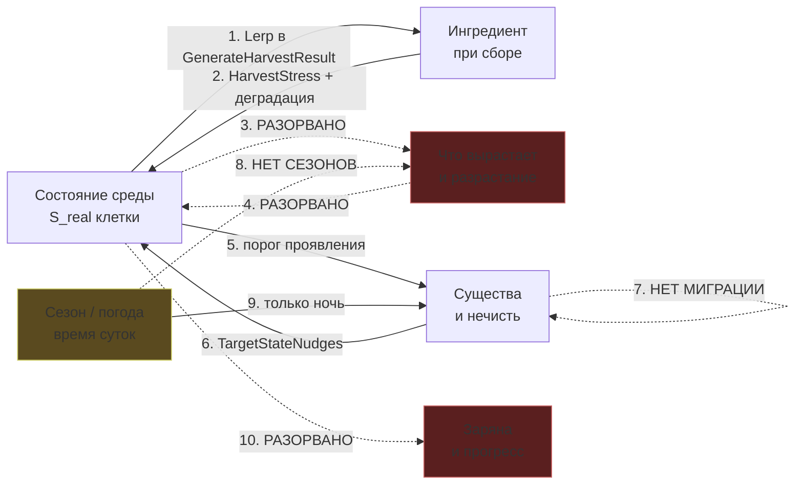

# Хранение состояния мира и связность зависимостей

Дата: 2026-08-23. Разбор двух связанных вопросов: как хранить состояние мира
(легче, с градиентами и перетеканием) и замкнута ли причинная цепочка
«ингредиент ↔ среда ↔ существа ↔ сезон ↔ Заряна».

Спутники: `ROADMAP.md`, `AUDIT_AND_REFACTORING_PLAN.md`, `META_AUDIT.md`.

---

## Часть I. Хранение состояния мира

### 1. Противоречие в самом ядре

`00_Core_Lock §1.2` описывает мир дословно как **«непрерывное поле состояний»**,
а §9 — «изменения происходят локально; они могут затухать, распространяться или
усиливаться».

Код делает ровно обратное:

```cpp
// GridWorldManagerCore.cpp:242-251 — назначение биомов
const int32 BlockSize = 5;
EBiomeType biome = AllBiomes[((Y/BlockSize) * BlocksX + (X/BlockSize)) % AllBiomes.Num()];
```

Биом присваивается **блоками 5×5 клеток по кругу**. Границы прямоугольные,
переходов нет, «биом» — жёсткий enum на клетке. Клетка либо целиком Болото, либо
целиком Тайга; промежуточных состояний не бывает.

То есть «кубический мир» — не побочный эффект прототипа, а **прямое нарушение
собственного инварианта проекта**. И оно же — корень проблемы с весом: раз каждая
клетка независима и полна, её приходится хранить целиком.

### 2. Что хранится сейчас

На клетку (`FGridCell`): `State` (11 float) + `TargetState` (11) + `Environment` (3)
+ `Memory` (5) + `HarvestStress` + 3 флага/имени + `TArray` акторов.
Порядка **130+ байт на клетку**, из них ~90 — два почти одинаковых состояния.

При 20×20 это 50 КБ — неважно. При 200×200 — уже 5 МБ на каждый снапшот, и это
без истории. Плюс `RegenerateCellParameters` каждый кадр гоняет 11 лерпов **по
всем** клеткам, включая те, где ничего не происходило никогда.

### 3. Четыре варианта

#### Вариант A. Разреженные отклонения над процедурной базой ⭐

**Идея:** база мира не хранится вообще — она вычисляется из позиции и сида.
Хранятся только **отклонения**, вызванные игроком и событиями.

```
State(x,y) = Base(x,y, Seed) + Deviation(x,y)
                ↑ функция, 0 байт      ↑ хранится, только где ≠ 0
```

- **Вес:** O(того, что игрок реально тронул). Нетронутый мир — 0 байт.
- **Сохранение:** список отклонений. Для реалистичной сессии — единицы килобайт.
- **Градиенты:** бесплатно из шумовой базы.
- **Релаксация упрощается радикально:** сейчас это 11 лерпов `State → TargetState`
  на клетку; станет `Deviation *= decay`, а клетки с нулевым отклонением можно
  **вообще не обходить**. И перф, и код проще.
- **Ложится на существующую архитектуру почти без швов:** в коде уже есть пара
  `State` / `TargetState` и релаксация между ними. `TargetState` становится
  вычисляемой базой, `Deviation = State − TargetState` — тем, что хранится.
  `FStateDelta` уже оперирует именно отклонениями.

**Минус:** база должна быть строго детерминированной функцией — то есть
`RegenerateCellParameters` больше не может «тянуть куда угодно», цель задаётся
процедурой. Для мира, который меняется по сюжету, нужен механизм смещения самой
базы (медленный, отдельный слой).

#### Вариант B. Источники влияния (sparse influence sources)

**Идея:** хранится не сетка, а список **источников**: точка, радиус, кривая
спада, вектор смещения состояния, время жизни.

```
State(x,y) = Base(x,y) + Σ Source_i.Delta · Falloff(dist_i / Radius_i)
```

- **Вес:** десятки-сотни источников на весь мир вместо десятков тысяч клеток.
- **Распространение — встроено:** источник растёт (Radius↑), затухает
  (Delta↓), дрейфует. Это буквально «затухают, распространяются или усиливаются»
  из §9, а не эмуляция этого.
- **Рваные границы:** искажение расстояния шумом (domain warping) даёт органичные
  кляксы вместо кругов.
- **Отлично ложится на лор:** капище — источник со знаком плюс, Гнильники —
  со знаком минус, катастрофа варки — вспышка с затуханием. Каждая сущность и
  событие естественно выражается источником.

**Минус:** запрос состояния в точке — O(источников рядом), нужен пространственный
хэш. И «история места» перестаёт быть явной: чтобы узнать, что тут было, надо
знать все источники, что здесь побывали.

#### Вариант C. Поля как текстуры

**Идея:** шесть мета-параметров — шесть каналов текстур (R16), скажем 256×256 на
весь мир. Распространение = размытие/диффузия в шейдере.

- **Вес:** 256×256×6×2 байта = **786 КБ** на весь мир, независимо от его размера.
- **Градиенты и перетекание — нативно:** билинейная выборка даёт гладкость,
  диффузионный шейдер даёт распространение практически бесплатно.
- **Задел уже есть:** `Content/Materials/MPC_WorldStateFields.uasset` — кто-то
  уже начал выводить состояние мира в материалы.

**Минус, серьёзный:** чтение с GPU обратно на CPU асинхронно и неудобно, а
геймплейная логика (варка, сбор) должна читать состояние синхронно и
детерминированно. Как **единственный** источник истины не годится.

**Но как визуальный слой — идеально**, и это ровно то решение, к которому мы уже
пришли по PCG раньше: симуляция на CPU, картинка из полей.

#### Вариант D. Квантованные массивы (SoA)

**Идея:** вместо `TArray<FGridCell>` — отдельный массив на параметр, `uint8`
вместо `float`.

- **Вес:** 6 байт на клетку вместо ~130. В **20 раз легче**, при точности 1/255 —
  для величин из [0,1] более чем достаточно.
- Самая дешёвая правка из четырёх, ничего концептуально не меняет.
- **Градиенты сам по себе не даёт** — нужна интерполяция при выборке сверху.

### 4. Что я рекомендую

**A + B как ядро, C как визуальный слой, D — если нужно быстро и дёшево.**

Конкретно:

1. **База — процедурная и непрерывная (A).** Биом перестаёт быть enum'ом на
   клетке и становится **весовым вектором**: точка мира на 70% Болото и на 30%
   Пойма, её базовое состояние — смесь. Это одним движением убирает и кубические
   границы, и половину веса хранения. Рваность даёт warped noise поверх весов.

2. **Всё, что делают игрок и события — источники влияния (B).** Сбор, варка,
   капище, проявленная сущность. Они живут, растут и затухают. Хранится только
   их список — это и есть сейв мира.

3. **Текстурные поля (C) — только для картинки.** Симуляция читает A+B на CPU
   детерминированно, в текстуры выгружается результат для материалов и PCG.

4. **Сетка остаётся — но как способ выборки, а не как определение мира.** Это
   ключевой сдвиг: сейчас сетка *есть* мир, станет — *ускоряющая структура* для
   запросов к непрерывному полю.

### 5. Путь миграции (без большого взрыва)

Порядок такой, что после каждого шага проект работает:

| Шаг | Что | Риск |
|---|---|---|
| 1 | `Deviation = State − TargetState`, релаксация → затухание отклонения; пропускать клетки с нулём | ✅ ВЫПОЛНЕНО 2026-08-23 — `RegenerateCellParameters` переписан на единый `MoveToward` по всем 7 осям Meta+Magnitude вместо 4 явных if/else; заодно закрыт побочный пробел — Potency/Resonance/Corruption раньше вообще не релаксировали к TargetState, теперь релаксируют как все. Direction пропускается целиком при пренебрежимо малом отклонении. |
| 2 | Биом → весовой вектор; `GetDefaultState` возвращает смесь по весам | средний, трогает генерацию |
| 3 | Базу вынести в чистую функцию `Base(x, y, Seed)`; `TargetState` перестать хранить | средний |
| 4 | Источники влияния как отдельный слой поверх | новый код, ничего не ломает |
| 5 | Сейв = сид + список источников + оставшиеся отклонения | тривиально после 3-4 |
| 6 | Выгрузка полей в текстуры для материалов/PCG | изолировано |

Шаг 1 полезен сам по себе, даже если дальше не идти.

---

## Часть II. Связность зависимостей

### 6. Задуманная цепочка и её реальное состояние



Пунктир — разорванные связи. Сплошные — работающие.

### 7. Разбор по звеньям

| # | Связь | Состояние |
|---|---|---|
| 1 | Среда → свойства собранного | ✅ `GenerateHarvestResult`, Lerp с `Resilience`. Работает и проверено численно. |
| 2 | Сбор → истощение среды | ✅ `HarvestStress` + деградация. Починено в этой сессии (frame-rate). |
| 3 | **Среда → что вырастает** | ❌ **Главный разрыв.** См. ниже. |
| 4 | Разрастание → среда | ❌ Ресурсы появляются и просто существуют. Никакого обратного влияния. |
| 5 | Среда → проявление сущностей | ✅ Гнильники по порогу Corruption, Берегиня по HistoryPurity. |
| 6 | Сущности → среда | ✅ через `TargetStateNudges`. |
| 7 | Миграция существ | ❌ Сущности проявляются на месте по порогу и гаснут. Не перемещаются. |
| 8 | Сезон/погода → ингредиенты | ❌ Сезонов нет. `TimeOfDayMask` есть у `UHerbalistIngredient`, но **не у `FIngredientTableRow`**, а игра читает именно таблицу. Плюс сам enum нигде не определён. |
| 9 | Время суток → сущности | 🟡 Только `IsNight()` для Морочников, и та не видна игроку. |
| 10 | Прогресс игрока → Заряна | ❌ Ничего. |

### 8. Главный разрыв — звено 3

```cpp
// GridWorldManagerCore.cpp:356
FName IngredientID = IngredientSubsystem->GetRandomResourceForBiome(Cell.Biome, WorldRNG);
```

**Что вырастает в клетке, зависит только от enum'а биома.** Испорченная клетка
Болота (`Corruption 0.9`, стресс 0.8, проявились Гнильники) и нетронутая клетка
Болота рядом дают **одинаковый набор трав с одинаковой вероятностью**.

Это разрывает петлю в самом важном месте. Игрок воздействует на мир — мир меняет
состояние — и **мир не отвечает** тем, что в нём растёт. Обещание ГДД
(`00_Core_Lock §6`: «Player → изменение BiomeState → изменение мира → восприятие»)
на этом звене обрывается: изменение мира не доходит до того, что игрок видит
и собирает в следующий раз.

**Как чинить — минимально:** `AllowedBiomes` (жёсткий список) заменить на
пригодность по состоянию. У ингредиента уже есть `BaseState`; естественная
метрика — насколько состояние клетки близко к его природе:

```
Пригодность(ингредиент, клетка) = f(расстояние между Cell.State и Row.BaseState)
                                × СезонныйМножитель
                                × (1 − HarvestStress)
```

Тогда всё встаёт на места само:
- в испорченной клетке чистые травы перестают всходить, а гнильные — наоборот;
- истощённая сборами клетка родит меньше и хуже — обратная связь по звену 4
  появляется без отдельной механики;
- сезонный множитель (звено 8) вставляется в ту же формулу одним сомножителем;
- `Resilience` получает второй смысл: своевольные травы менее чувствительны
  к пригодности места.

Это же **закрывает звено 4**: разрастание перестаёт быть нейтральным, потому что
состав того, что выросло, определяется состоянием — и при следующем сборе (звено 1)
влияет на собранное.

### 9. Звено 10 — Заряна

Сейчас Заряна существует только в `03_Narrative`. Механически её нет вовсе.

Между тем в проекте **уже есть готовая величина** для её состояния —
`Distance(S_real, S0)` из `00_Core_Lock §1.1`, ради которой чинится `S0`
(`ROADMAP §2.3`). Заряна описана как «отражение состояния мира», находящаяся
«на границе между Явью и Навью» — то есть буквально как **функция расстояния мира
до Алатыря**. Ничего нового считать не надо: чем ближе мир к S0, тем ближе она
к Яви.

Это делает связь 10 не новой системой, а **отображением уже существующей метрики**,
и объясняет, почему `S0` в дорожной карте стоит так рано.

### 10. Попутная находка: недетерминированный спавн

```cpp
// GridWorldManagerCore.cpp:353, 359-360
int32 NumResources = FMath::RandRange(1, 3);                    // глобальный ГПСЧ
FVector Offset = FVector(FMath::FRandRange(...), ...);          // глобальный ГПСЧ
```

Соседняя строка 356 использует `WorldRNG` правильно, а эти три — глобальный
поток `FMath`. То есть **количество и расположение ресурсов не воспроизводятся
по сиду**, хотя весь проект построен на детерминизме и имеет систему
трассировки/реплеев.

Правка тривиальна (`WorldRNG.RandRange` / `WorldRNG.FRandRange`), но найти это
стоило только потому, что мы полезли в спавн. Отнести в
`AUDIT_AND_REFACTORING_PLAN §1`.

---

## 11. Итог: что решать

1. **Модель хранения** — выбрать из четырёх вариантов (§3). Рекомендация:
   A+B ядро, C визуал.
2. **Звено 3** — заменить `AllowedBiomes` на пригодность по состоянию (§8).
   Самая большая отдача на единицу работы во всей цепочке: чинит сразу 3, 4
   и открывает 8.
3. **Заряна** — подтвердить, что её состояние = `Distance(S_real, S0)` (§9).
   Если да, отдельной системы не нужно, нужен только `S0`.
4. **Миграция существ** (звено 7) — отдельный разговор: нужна ли она вообще,
   или «проявление по порогу» и есть задуманная форма, а миграция ей противоречит
   (`00_Core_Lock §5`: сущности — не агенты, а проекции состояния).

---

## Часть III. Существа и ингредиенты: устранение смысловых разрывов

### 12. Противоречие, которое надо снять первым

С одной стороны, `00_Core_Lock §5` жёстко запрещает агентность:
«Сущности **не являются агентами** и не обладают собственной логикой поведения.
Entity = Projection(BiomeState)».

С другой — лор говорит о хозяевах мест: леший живёт в лесу, полевик в поле,
водяной в омуте. У них есть дом, они гневаются, их можно прогнать.

Разрыв кажущийся, и снимается он одной формулировкой:

> **«Хозяин ушёл» — это не перемещение агента, а прекращение проекции.**

В фольклоре покинутое место не «остаётся без жильца, который куда-то убрёл» —
оно перестаёт быть тем местом, чьим хозяином он был. Сведённый лес перестаёт
быть лесом, и лешему нечего быть проекцией. Никакого движения не происходит,
инвариант не нарушен, а с точки зрения игрока это выглядит ровно как уход.

### 13. Две независимые оси

Из лора вытекают именно две, и их нельзя смешивать:

| Ось | Что определяет | Чем задаётся | Диапазон |
|---|---|---|---|
| **Присутствие** | проявлен ли хозяин здесь вообще | соответствие состояния места природе существа | да / нет |
| **Расположение** | как он к игроку относится | накопитель `Respect` от поступков игрока | −1 … +1 |

Смешение этих осей — источник путаницы «злится или уходит?». На деле:

- **Испортил место** → падает *соответствие* → хозяин **перестаёт проявляться**.
  Не обиделся, а просто больше не про это место.
- **Нарушил правила обращения** (сорвал не так, не в тот час, без поклона) →
  падает *расположение* → хозяин на месте, но **вредит**.

Второе уже спроектировано в `16_Entity_Manifestation §16.3` (аккумулятор Respect)
и наполовину реализовано для Полевика. Первое — то, чего не хватало.

Проверка по лору: «выкуришь всех домовых и кикимор, но и сам без защиты
останешься — **они потом злее вернутся**» (карточка полыни). Здесь обе оси
работают раздельно и явно: присутствие сброшено, расположение унесено в минус,
и при возврате присутствия расположение остаётся плохим.

### 14. Вытеснение вместо миграции

Когда хозяин перестаёт проявляться, место не остаётся пустым — условия теперь
соответствуют кому-то другому. Гнильники уже проявляются по порогу Corruption,
Злыдни в лоре привязаны к заброшенному жилью.

**Это выглядит как миграция, но не является ею.** Никто никуда не идёт —
меняется то, чьим отражением место является. Экологическая сукцессия, а не
переселение. Так снимается вопрос «нужна ли миграция»: не нужна, и хорошо, что
не нужна — она бы нарушила `§5`.

Практически это уже почти работает: механизм проявления по порогу есть, нужно
лишь добавить **приоритет** (кто вытесняет кого при совпадении условий) и
**гистерезис**, чтобы хозяин не мигал на границе порога.

### 15. Ингредиенты: биом решает «кто», состояние решает «сколько»

Здесь моё предыдущее предложение (§8) было слишком радикальным — заменить
`AllowedBiomes` пригодностью по состоянию значило бы стереть ботаническую
привязку, а она и есть лор: багульник растёт на болоте, брусника в тайге.

**Правильная форма — двухступенчатый фильтр:**

```
1. КТО МОЖЕТ здесь расти  = AllowedBiomes          (лор, ботаника — не трогаем)
2. СКОЛЬКО и КАКОГО качества = f(близость Cell.State к Row.BaseState)
                             × СезонноеОкно × ПогодноеОкно × (1 − HarvestStress)
```

**Проверено на реальных данных — второй ступени есть на чём работать.**
Внутри одного только Болота (эталон биома: `Purity 0.35`, `Corruption 0.70`):

| трава | Purity | Corruption |
|---|---|---|
| Бѣлый мохъ (сфагнум) | 0.80 | 0.15 |
| Журавина (клюква) | 0.70 | 0.15 |
| Багульник | 0.40 | 0.60 |
| **Белокрыльник** | **0.35** | **0.70** |

Размах Purity внутри одного биома — **0.45**. Белокрыльник — точная копия
эталона Болота, сфагнум — противоположный полюс. То есть:

- в **испорченной** клетке Болота всходят белокрыльник и багульник,
  а сфагнум и клюква исчезают;
- в **очищенной** (например, рядом с капищем) — наоборот.

Биом сохраняется полностью, а состояние решает состав внутри него. Никаких новых
данных не нужно — работает на уже написанных значениях компендиума.

**Побочный выигрыш от весовых биомов** (Часть I): на границе, где клетка на 60%
Болото и на 40% Пойма, могут всходить травы обоих — что верно и биологически
(экотоны богаче), и снимает искусственность резких границ.

### 16. Главное: связка уже написана в компендиуме

**58 из 71 карточки трав упоминают существ**, и не декоративно — там прямо заданы
правила обращения и последствия:

| Из карточки | Что это механически |
|---|---|
| «Только не топчи его — **прогневаешь полевика**, он тебе дорогу в степи **на три года** перекроет» | Respect↓ + длительность последствия |
| «под каждым цветком спит лесовик, сорвёшь — **проснётся и пойдёт по лесу злым**» | сбор конкретной травы бьёт по Respect хозяина |
| «Собирать **на рассвете**, пока цветок не раскрылся, но только **в сухой день и без ветра** — иначе лесовик рассердится» | окно времени суток + погодное условие + штраф за нарушение |
| «с живого брать нельзя — **водяной проклянёт**» | правило способа сбора |
| «берут её только по великой нужде, **с поклоном и мёдом у корней**» | подношение как условие безнаказанного сбора |

То есть **вся цепочка «трава → хозяин → среда → погода → время суток» уже
существует в прозе**. Это задача на извлечение, а не на проектирование — тот же
паттерн, что `extract_biomes.py`: разобрать карточки, вынести в поля таблицы,
докладывать неоднозначности, ничего не решая молча.

Предлагаемые новые поля `FIngredientTableRow`:
`GuardianEntity` (кто хозяин), `HarvestTimeWindow`, `HarvestWeather`,
`DisrespectPenalty`, `SeasonWindow`.

### 17. Замкнутая схема

```mermaid
graph TD
    ENV[Состояние среды<br/>S_real клетки]
    GROW[Что и сколько<br/>вырастает]
    ING[Собранное<br/>свойства]
    ENT[Хозяин места<br/>присутствие + Respect]
    SEA[Сезон, погода,<br/>время суток]
    S0[Distance к S0]
    ZAR[Заряна]

    ENV -->|близость State к BaseState| GROW
    GROW -->|состав определяет| ENV
    ENV -->|Lerp, Resilience| ING
    ING -->|HarvestStress, деградация| ENV
    ING -->|нарушение правил сбора| ENT
    ENV -->|соответствие природе| ENT
    ENT -->|TargetStateNudges| ENV
    ENT -->|вытеснение при уходе| ENT
    SEA -->|окна доступности| GROW
    SEA -->|условия сбора| ING
    SEA -->|ночь, полдень| ENT
    ENV --> S0
    S0 -->|отражение состояния мира| ZAR

    style ENV fill:#1f3a5a,stroke:#69c
    style ZAR fill:#1f5a2f,stroke:#6c9
```



Разрывов не остаётся: каждое звено либо работает, либо имеет источник данных
в уже написанном лоре.

### 18. Что решать по этой части

1. **Подтвердить двухосевую модель** (§13): присутствие = соответствие месту,
   расположение = Respect. Если да — Полевик из `§16.3` дорабатывается до неё,
   а не переписывается.
2. **Подтвердить двухступенчатый фильтр ингредиентов** (§15): `AllowedBiomes`
   остаётся, состояние модулирует. Это отменяет моё прежнее предложение из §8.
3. **Запускать ли извлечение связок из карточек** (§16) — это заметная работа
   по 71 файлу, но она даёт сразу и сезоны, и погоду, и связь трав с хозяевами.
4. **Приоритет вытеснения** (§14): кто кого вытесняет. Это уже чисто дизайнерское
   решение, из лора напрямую не выводится.

---

## Часть IV. Приоритет вытеснения — по фольклору (п.4)

Собрано веб-поиском 2026-08-23. Источники — в конце раздела.

### 19. Вопрос был поставлен не совсем в той форме

Искал «кто кого вытесняет» — и фольклор поправил рамку. Для леса и воды это
действительно строгая иерархия: **«В иерархии духов природы... леший –
это лесной хозяин, которому подчиняются другие лесные духи (лесовики, боровики,
моховики)»**, а у воды буквально то же самое: **«Водяной... даже считается их
[русалок] хозяином. Русалки, мавки и утопленники находятся в его подчинении»**.

Но для Болота источники говорят обратное — **не конкуренция, а родство**:
Болотник — «злой дух-хозяин болота, являющийся **родичем** Водяного и Лешего»,
а Кикимора Болотная — «то ли жена она ему [Лешему], то ли дочь непутёвая,
**вместе** они путников с пути сбивают». Прямых сравнений силы источники не дают —
похоже, что «по поверьям они скорее сотрудничали, чем конкурировали, обитая в
соседних или одних и тех же пространствах».

**Вывод:** линейный приоритет годится не для всех биомов одинаково. Есть
«чистые» домены с одним хозяином и есть **пограничные**, где домены встречаются
и сосуществуют. Болото — не «испорченный лес», а фольклорно самостоятельная
пограничная территория, где встречаются родичи леса и воды — это, кстати,
объясняет и то, почему у Болота в игре самая тяжёлая Distortion (0.70): дело не
только в математике, это ещё и мифологически рубежная земля.

### 20. Итоговая структура

**А. «Чистые» биомы (Тайга, Степь, Широколиственный/Смешанный лес, Тундра) —
строгая лестница, ровно так, как уже спроектировано в §16.3-16.4:**

```
Легендарный (хозяин домена)  →  Основной (подчинённые хозяину духи)  →  Низший (симптом среды)
```

Проверка условия — сверху вниз, кто первый совпал, тот и проявлен. Это уже
устройство `16_Entity_Manifestation`, фольклор его подтверждает буквально
(«подчиняются», «в его подчинении»).

**Б. Пограничные биомы (Болото, вероятно Речная пойма — тоже стык леса и
воды) — со-присутствие, не вытеснение.** Здесь Основной и Низший уровни могут
проявляться на одной клетке одновременно, как Кикимора и «чащобные хороводы» у
источников. Практически: снимается риск коллизии `TMap::Add`
(`AUDIT_AND_REFACTORING_PLAN`, найдено при аудите вертикального среза) — на
Болоте это не гонка данных, которую надо чинить, а корректное поведение,
которое надо явно разрешить.

**В. Опасная нечисть — вне этой лестницы вовсе, гейт по времени, не по месту.**
Подтверждено прямо: **«упыри характеризуются как блуждающие, а не привязанные к
конкретному месту существа»** — земля таких мертвецов не принимает, потому они
скитаются. Это ровно то же нарочитое отсутствие привязки к биому, что уже
есть в `16.5` («Повсеместно»). Правильная реализация — не пятый уровень
лестницы, а отдельный временной слой, гейтящийся ночью, способный проявиться
поверх любого из А/Б независимо от того, кто там уже проявлен.

### 21. Побочная находка: происхождение Кикиморы — событие, не порог

Источник указывает конкретную причину: Кикимора заводится **на месте, где
случилось убийство, смерть, самоубийство** — то есть от единичного
катастрофического события, а не от постепенного накопления. Это отличается от
Гнильников (`Corruption > 0.6`, непрерывный порог) качественно, не количественно.

**Это прямая, конкретная зацепка за то, что мы только что почини́ли.**
`EAlchemyOutcome::Catastrophe` (аудит §2.1) до этой сессии не срабатывал никогда;
теперь, после замены насыщающей формулы Морока на степенную, он реально
достижим. Естественный следующий шаг: **Catastrophe в клетке сеет
Кикимора-подобный «шрам»** — не постепенно нарастающий, а мгновенно
проставленный при событии, стойкий к обычному зарастанию (не просто «Corruption
опустился ниже порога — исчезло», а требует отдельного очищения, ближе к
Restoration капища).

Это отдельная, третья форма проявления — не порог (Низший) и не Respect
(Основной), а **метка события**. Стоит завести как отдельный тип триггера.

### 22. Мелкая, но полезная асимметрия: Полевик слабее Лешего по своей природе

Источник: полевой «**не стал в народных представлениях полноправным хозяином
поля**, вероятно, потому что... его образ был подавлен такими покровителями
поля... как Богородица и святые Илья и Николай», и «к человеку полевой относился
**в основном враждебно**». Полудница же не столько хозяйка, сколько каратель:
«наказывала провинившихся, мстила своим обидчикам».

То есть в реальном фольклоре полевые духи — не такие полноценные благосклонные
хозяева, как леший: потолок их доброжелательности ниже, дефолт враждебнее.
Практически: у Полевика (уже реализован, `§16.3`) диапазон положительного
`Respect` стоит сделать у́же и труднее достижимым, чем будет у лесных хозяев,
когда до них дойдут руки — это не баг баланса, а фольклорная asimметрия между
типами биомов.

### Источники

- [Леший — Википедия](https://ru.wikipedia.org/wiki/%D0%9B%D0%B5%D1%88%D0%B8%D0%B9)
- [Славянская мифология — существа и духи: Леший, лесовик](http://slavyans.myfhology.info/nechist/leshiy-lesovik.html)
- [Кикимора болотная — bestiary.us](https://www.bestiary.us/kikimora-bolotnaja/ru)
- [Кикимора Болотная — Языческая Википедия (Fandom)](https://yaz.fandom.com/ru/wiki/%D0%9A%D0%B8%D0%BA%D0%B8%D0%BC%D0%BE%D1%80%D0%B0_%D0%91%D0%BE%D0%BB%D0%BE%D1%82%D0%BD%D0%B0%D1%8F)
- [Полевик (мифология) — Википедия](https://ru.wikipedia.org/wiki/%D0%9F%D0%BE%D0%BB%D0%B5%D0%B2%D0%B8%D0%BA_(%D0%BC%D0%B8%D1%84%D0%BE%D0%BB%D0%BE%D0%B3%D0%B8%D1%8F))
- [Полевик и полевые духи — Боги Славян](https://bogislavyan.ru/polevik-i-polevyie-duhi/)
- [Упырь — Неолурк](https://neolurk.org/wiki/%D0%A3%D0%BF%D1%8B%D1%80%D1%8C)
- [Водяной — Неолурк](https://neolurk.org/wiki/%D0%92%D0%BE%D0%B4%D1%8F%D0%BD%D0%BE%D0%B9)
- [Водяной и русалки — Мурзим](https://murzim.ru/nauka/mif/drevneslavjanskaja-mifologija/6639-vodyanoy-i-rusalki.html)
- [Народные приметы о домовом](https://horo.mail.ru/article/14299-primety-o-domovom/)
- [Как понять, что домовой ушёл из дома](https://besarte.ru/kak-ponyat-chto-domovoy-nedovolen-zlitsya-obidelsya-ili-ushel-iz-doma/)

---

## Часть V. Архитектура кода — проверка вместо предположений

По просьбе проверить связность плана — перечитал код заново, а не доверился
собственным прошлым записям. Две поправки к тому, что я писал раньше, и одна
находка, которая меняет порядок работ.

### 23. Поправка: Command Algebra и путь записи UI лучше, чем я утверждал

**Что я писал раньше (`ROADMAP.md`):** «Command Algebra — плоский enum», «виджеты
ходят в мир напрямую». Перепроверил построчно — оба утверждения неточны.

**Command Algebra уже реализована как размеченный union**, не enum:

```cpp
struct FCommandEntry {
    ECommandPrimitive Primitive;   // тег
    FQueryCommand    Query;    // Q
    FTransferCommand Transfer; // T
    FApplyCommand    Apply;    // D
    FHarvestCommand  Harvest;  // S
    FTalkCommand     Talk;     // B — пока заглушка (FDialogueID и всё)
};
```

Q/T/D/S/B — все пять примитивов на месте, каждый со своим типизированным телом.
Реальный, а не мнимый пробел — два места:
1. `Talk` (B) не реализован вовсе, только каркас;
2. `FCommandGraph` называется графом, но структурно это **плоский массив** с
   `ExecutionOrder: float`, без рёбер зависимости. Имя обещает больше, чем есть —
   не критично, но стоит либо реализовать зависимости, либо переименовать.

**Путь записи из UI — проверил каждый вызов, минующий `QueueCommand` напрямую:**

| Вызов | Что внутри |
|---|---|
| `CollectWater` | строит `FCommandEntry(Harvest)` → `QueueCommand` |
| `ApplyPotionToCell` | → `ApplyAlchemyResult` → строит `FCommandEntry(Apply)` → `QueueCommand` |
| `HarvestTest` | **мёртвый код** — `UE_LOG(..."deprecated")`, ничего не делает |
| `AlchemyTransferWidget`, действия игрока в `PlayerController` | `QueueCommand` напрямую |

Single Writer соблюдён **до самой границы UI**, без исключений. Комментарий в
`GridWorldManager.h` («тонкие обёртки, собирающие FCommandEntry... реальный
расчёт идёт в PipelineV2») — не аспирация, а точное описание того, что есть.

**Тогда откуда взялся баг с `Ash`/«Зола»?** Не из записи — из **чтения**. Каждый
виджет сам решает, как показать `IngredientID`: `AlchemySlotWidget` захардкодил
ветку `"Ash" → "Зола"`, `InventorySlotWidget` — нет, и остаётся с сырой строкой.
Это не отсутствие ViewModel-слоя как такового, а дублирование одной конкретной
функции (`GetItemDisplayName`) по трём файлам вместо одного места. Более узкая
и более дешёвая находка, чем «нужен архитектурный слой».

### 24. Главное: хранение мира и проявление сущностей — один и тот же механизм

Вот это меняет порядок работ по-настоящему.

Часть I (§3, вариант B) описывает **источники влияния**: точка, радиус, спад,
вектор сдвига состояния, время жизни — для истощения от сбора, катастроф варки,
капищ.

Часть III описывает **проявление сущностей**: амбиентная зона (Гнильники — порог
+ сдвиг состояния), обиталище-хозяин (Полевик — точка + `Respect` + сдвиг),
капище (§15.5 — точка + `Restoration` + сдвиг + радиус), метка катастрофы
(§21 — точка + сдвиг + устойчивость).

**Это один объект, описанный дважды в разных разделах.** У «источника влияния»
и «проявленной сущности» одинаковые поля: позиция, радиус, вектор сдвига,
кривая роста/спада, иногда владелец. Разница только в том, *что* заводит
источник (игрок собрал → истощение; порог Corruption пройден → Гнильники;
`Catastrophe` → шрам) и *как* он называется в UI.

**Практическое следствие — уже видно в собственном коде вертикального среза.**
`FEntityLandmark` (`HerbalistCoreTypes.h:173`, из прошлой сессии) — это
самостоятельная, отдельная от всего остального структура: `EntityID`, `Cell`,
`Respect`. Если сейчас начать капища или следующих существ бестиария, не
пересобрав хранение, получится **третья** параллельная мини-система с теми же
по смыслу полями. Реализовывать сущности до источников — значит писать один и
тот же код трижды и потом сводить обратно.

**Правка порядка:** обобщённая структура источника — не пункт фазы C, а часть
фазы A, до сущностей и капищ:

```cpp
struct FInfluenceSource
{
    EInfluenceKind Kind;      // AmbientZone, Host, Shrine, CatastropheScar, ...
    FVector2D Position;
    float Radius;
    FRealState Delta;         // куда тянет
    float Strength;           // 0..1, растёт/падает по своей формуле для Kind
    FName OwnerID;            // Гнильники / Полевик / имя капища / пусто
};
```

`FEntityLandmark`, будущее «капище», будущий «шрам катастрофы» — это не три
типа, а один тип с разным `Kind` и разной формулой изменения `Strength`.
Гнильники (§16.2) заводят источник при пороге и гасят при выходе из порога;
Полевик — растит/гасит `Strength` по формуле `§16.3`; капище — по формуле
`Restoration` (`15_Cycles §15.5`); шрам — мгновенно при `Catastrophe`, спадает
медленно (`§21`).

Дизайн-приоритет вытеснения (Часть IV, §20) становится не отдельным
куском кода, а правилом чтения: на одной точке может быть несколько
`FInfluenceSource` разных `Kind` — «чистые» биомы разрешают показывать только
источник высшего приоритета (Легендарный > Основной > Низший), «пограничные»
(Болото) показывают несколько сразу. Правило одно, реализуется в момент
запроса состояния точки, не в момент создания источника.

### 25. Проверка связности между разделами — построчно

| Связь | Согласовано? |
|---|---|
| Весовые биомы (Ч.I §4.1) ↔ двухступенчатый фильтр ингредиентов (Ч.III §15) | ✅ Согласуется, но неявно: `AllowedBiomes`-гейт должен проверяться против **веса** биома в точке, не бинарно. На границе 70%/30% ингредиент 30%-биома должен встречаться реже, не отсутствовать. Стоит явно прописать при реализации. |
| Источники влияния (Ч.I §3B) ↔ проявление сущностей (Ч.III) | ✅ Согласуется полностью — это один механизм, см. §24 выше. |
| Приоритет вытеснения (Ч.IV §20) ↔ хранение | ✅ Согласуется — превращается в правило чтения по `Kind`, не в отдельный код. |
| `GuardianEntity` у ингредиента (Ч.III §16) ↔ источники влияния | ✅ Согласуется — это `OwnerID` источника типа `Host`, на который ссылается карточка травы. |
| Заряна = `Distance(S_real, S0)` (Ч.II §9) ↔ хранение | ✅ Не пересекается — производная скалярная величина над полем, вычисляется на чтении, ничего не хранит сама по себе. |
| Command Algebra (§23) ↔ источники влияния | 🟡 Не пересекается напрямую, но `FApplyCommand`/`FHarvestCommand` — естественные точки, где заводится новый `FInfluenceSource` (Catastrophe → шрам, сбор → истощение). Стоит в реализации явно связать. |

Противоречий не нашёл. Единственная содержательная правка — §24: порядок фаз.

### 26. Обновлённый порядок (заменяет часть `ROADMAP.md §5`)

Фаза A получает четвёртый пункт, **перед** сохранением по номеру, но фактически
это предпосылка к нему:

```
0. FInfluenceSource как общий тип (§24) — ядро, ничего пока не создаёт
1. Сохранение = сид + список FInfluenceSource + оставшиеся отклонения
2. DA_BiomeGraph → JSON
3. S_Perceived до котла
```

Дальше `ROADMAP.md` не меняется: Фаза B (S0, Distance, Травник), Фаза C
(капища, Кикимора-шрамы, фрагменты Заряны) и Фаза D (луна/сезоны/бестиарий)
теперь **потребляют** `FInfluenceSource`, а не изобретают своё хранение — сама
работа не увеличилась, просто не придётся её частично переделывать.

---

## Часть VI. Живость существ — не статичный порог, а система (п.7)

Задача от 2026-08-23: «капище/гнильника — одна модель, существа — тут
интереснее, нужна система, не такая статичная. Нужно продумать её живость».
Это дизайн-предложение, не код — код появится после вашей реакции.

### 27. Ограничение, внутри которого работаем

`00_Core_Lock §5`: «Сущности не являются агентами и не обладают собственной
логикой поведения... Entity = Projection(BiomeState)». Значит «живость» нельзя
получить через ИИ/поведенческие деревья/цели — это прямо запрещено. Но
статичность текущего среза (порог пройден → флаг поднят, порог не пройден →
флаг снят) — не единственная альтернатива агентности. Ниже — четыре механизма,
каждый живой (не тикает по прямой линии между двумя состояниями), но ни один
не наделяет сущность собственной волей: все они — свойства **проекции**, а не
поведение объекта.

### 28. Механизм 1 — дрейф вслед за причиной, не «сущность идёт»

Источник (`FInfluenceSource`, Часть V §24) не обязан стоять на одной точке,
пока действует его условие. Каждый тик его позиция немного смещается к
локальному максимуму того, что его порождает, внутри небольшого радиуса
поиска.

Формально: `Position += ∇(TriggerField) × DriftSpeed × DeltaTime`, где
`TriggerField` — то самое поле, чей порог сущность отражает (Corruption для
Гнильников, Restoration для капища). Гнильники не «идут туда, где грязнее» —
центр пятна порчи смещается туда, куда сместился пик Corruption, потому что
Гнильники и есть проекция этого пика. Тот же эффект, что дал бы агент с целью
«иди к source of corruption», но полученный без единой строки поведения —
чистое следствие того, что проекция обязана следовать за тем, что проецирует.

### 29. Механизм 2 — дыхание в ритме уже построенных циклов

`15_Cycles_And_Shrines` уже даёт три готовых ритма (сутки/луна/сезон), но
сейчас их читает только Морочники (фаза ночи). Каждый источник получает
множитель силы, привязанный к тем же фазам — не новая система, а второй и
третий потребитель уже написанной:

`EffectiveStrength = BaseStrength × CyclePhaseModulation(TimeOfDay, Moon, Season)`

Полудница уже спроектирована как всплеск ровно в полдень (§16.2) — это
частный случай общего правила, не исключение. Хозяин леса может быть тише
днём и отчётливее в сумерки; капище — заметнее растущей луной. Существо не
«решает» быть сильнее ночью — просто одна и та же формула, что уже определяет
фазу суток для всего мира, теперь умножает не только Distortion восприятия, а
и силу каждого источника.

### 30. Механизм 3 — инерция вместо переключателя

`FMemoryState` уже содержит `DistortionVelocity` и `TimeOfLastDistortionChange`
— оба объявлены, ни разу не прочитаны нигде в коде (тот же паттерн, что уже
не раз находился в этом проекте, `META_AUDIT.md`). Это готовый крючок для
инерции: `Strength` источника не прыгает мгновенно к целевому значению по
порогу, а имеет собственную скорость изменения, которая сама меняется
постепенно (та же математическая форма пружины/демпфера, что и подошла бы
для «настроения» хозяина места — расти, замедляться, поворачивать вспять, а
не щёлкать между 0 и 1).

Практически: гнев Полевика после единичного грубого сбора должен нарастать,
а не появляться сразу на полную силу, и после того как игрок прекратил
безобразничать — не гаснуть мгновенно, а долго остывать. Фольклорно это и
есть «памятливость» хозяина места, о которой прямо говорит компендиум
(«он тебе дорогу в степи на три года перекроет» — Полевик, `META_AUDIT §16`
прошлой сессии).

### 31. Механизм 4 — сложность из совместности, не из отдельной сущности

Часть IV уже установила: на пограничных биомах несколько источников разных
`Kind` могут действовать на одной точке одновременно (Кикимора и Болотник —
не конкуренты, а родичи). `09_Entities §9.7` независимо описывает то же самое
как «переходные состояния» — формы, что «сочетают признаки разных состояний».

Это даёт живость почти бесплатно: если Гнильники (Низший, амбиентный) и,
скажем, будущая Кикимора (Основной/Легендарный, событийная метка от
Catastrophe) действуют на одной клетке Болота одновременно, их источники
складываются — и результат не похож ни на чистого Гнильника, ни на чистую
Кикимору, а на что-то третье, не спроектированное отдельно, а возникшее из
наложения двух простых правил. Ни одно правило не стало сложнее — сложность
родилась из их встречи, как в любой живой системе (погода, стаи птиц), не из
интеллекта отдельного элемента.

### 32. Итог: четыре простых правила, не одна большая система

Ключевое свойство предложения — ни один из четырёх механизмов не требует
нового вида объекта или новой системы: дрейф — это чтение уже существующего
поля состояния; дыхание — второй потребитель уже написанных циклов; инерция —
чтение уже объявленных, но пустующих полей `Memory`; совместность — уже
принятое решение о пограничных биомах, доведённое до предсказуемого следствия.
Всё это — параметры одного и того же `FInfluenceSource` (Часть V), не четыре
отдельных подсистемы.

**Статус:** дизайн-предложение, код не начат — Гнильники/капище (общая
модель источников) идут первыми в реализации (подтверждено), четыре
механизма живости накладываются сверху, как только источники существуют как
структура, а не как разрозненные `FEntityLandmark`/пороги по отдельным
существам.

---

## Часть VII. Единая модель восприятия — два семейства, не четыре механики

Задача от 2026-08-23: свести Молву (`17_Hero_And_Community §17.3`), Coherence
(`PipelineV2::ComputeIntentCoherence`) и `Distance(S_real, S0)` (`§9` этого
документа) в одну модель. При разборе оказалось, что их на самом деле не
три, а больше — и все они укладываются ровно в два разных по природе
семейства, не в один плоский список.

### 33. Проверка вскрыла настоящую находку, не только беспорядок

Формула роста у Restoration (капище, `15_Cycles §15.5`), Respect (хозяева
места, `16_Entity_Manifestation §16.3`) и Molva (община, `17_Hero_And_
Community §17.3`) **написана дословно одинаково в трёх местах**, включая
формулу для Molva, добавленную только что:

```
ΔX = Gain × (Coherence − 0.5) × 2 × (1 − «плохое»)
```

Но «плохое» — не одно и то же значение: у Restoration и Respect это
`Distortion`, у Molva — `Corruption` (несовпадение, которое возникло
случайно при написании §17.3, не было решением). Разбор показал, что за
этим стоит настоящее, стоящее сохранения различие, а не опечатка:

- **Место и хозяин места** реагируют на **Distortion** — их волнует, было
  ли действие структурно аккуратным, предсказуемым (дух места не про мораль,
  а про порядок).
- **Община людей** реагирует на **Corruption** — жителей волнует не
  хаотичность процесса, а то, было ли то, что сделано, «нечистым» в смысле,
  близком к моральному (стали бы вы держать рядом с домом то, что этим
  зельем провоняло).

Разные стороны заботятся о разном — не потому, что так решили заранее, а
потому что нашли это при попытке свести формулы воедино. Стоит зафиксировать
как осознанное решение, не оставлять случайным совпадением.

### 34. Два семейства, не одна ось

**Семейство 1 — чтение состояния (мгновенное, без памяти).** Отвечает на
«что мир из себя представляет прямо сейчас» — две ортогональные величины,
обе вычисляются из `Cell.State` заново каждый раз, ничего не копят:

- **Явь/Навь** (`02_Setting.md`) — насколько мир **читаем**: устойчив он
  или обманчив. Управляется `Distortion`.
- **Distance(S_real, S0)** (`§9` этого документа) — насколько мир **хорош**:
  близок к идеалу или далёк от него. Это не то же самое измерение, что
  Явь/Навь — место может быть предельно читаемым (низкий Distortion) и
  при этом далёким от S0 (устойчиво испорченным: высокий Corruption при
  низком Distortion — стабильно плохое место, не обманчивое, а откровенно
  плохое). Правь, убранная из проекта (`CONCEPT_ANALYSIS §2.1`), описывала
  именно пересечение этих двух — «Явь, доведённая до предела» — что и
  подтвердило, что она была не третьей осью, а точкой на пересечении двух
  уже существующих.

**Семейство 2 — накопитель отношений (память, растёт от паттерна
действий).** Отвечает не «что есть», а «как ко мне относятся» — три домена,
**одна и та же формула**, разный адресат и разный «датчик плохого»:

| Домен | Накопитель | «Плохое» в формуле | Где описан |
|---|---|---|---|
| Место | Restoration | Distortion | `15_Cycles §15.5` |
| Существо-хозяин | Respect | Distortion | `16_Entity_Manifestation §16.3` |
| Община людей | Molva | Corruption | `17_Hero_And_Community §17.3` |

### 35. Coherence — не третье семейство, а мост между ними

Coherence (`ComputeIntentCoherence`) не персистентна и не является
«осью восприятия» сама по себе — это свойство **одного конкретного
действия** (состава варки), не мира и не отношений. Её роль — единственный
вход, которым момент («это действие было согласованным») превращается в
память (Семейство 2). Coherence ничего не хранит сама, но без неё ни один
накопитель Семейства 2 не может расти или падать. Схема целиком:

```
Одно действие → Coherence (мгновенно, не хранится)
                    ↓
       ΔX = Gain × (Coherence − 0.5) × 2 × (1 − «плохое»)
                    ↓
   Restoration / Respect / Molva (хранятся, копятся, забываются)


Cell.State (хранится) → Явь/Навь (читаемость)      ⟩ Семейство 1,
                      → Distance(S_real, S0) (близость к идеалу) ⟩ без памяти
```

### 36. Практический вывод — формулу пишем один раз, не три

Три экземпляра одной и той же формулы в трёх ГДД-главах — не ошибка (числа
разные осознанно, `Gain` разный по домену), но описание избыточно. При
реализации — один общий код на все три домена (тот же вывод, что уже
сделан для `FInfluenceSource` в Части V): параметризовать `Kind` (Place /
Entity / Community) и `BadTerm` (Distortion / Corruption) вместо трёх копий
одной функции.
