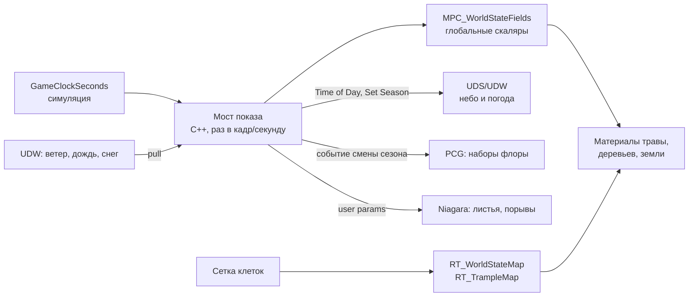

# Живая растительность: сезоны, сутки, погода — связь шейдеров, PCG и симуляции

Исследование и план (2026-09-16, запрос пользователя): как подключить функции
материалов к шейдерам и связать экосистему воедино — листопад и исчезновение
травы по сезонам через Ultra Dynamic Weather, раскрытие цветов по времени суток,
что из этого может взять PCG. **Только план, кода нет.** Черновик, не канон.

Пометки: ✅ — подтверждено кодом проекта или прочитанным первоисточником;
⚠️ — подтверждено поиском или разбором, но не проверено в редакторе на нашей
версии; ❓ — не найдено, нужна проверка.

## Решения пользователя (2026-09-16)

Ответы на вопросы §8 первой версии документа. Текст ниже уже приведён к ним.

| # | Вопрос | Решение |
|---|---|---|
| 1 | Длина визуальной осени | **Уточнено:** год 365 суток, обычный календарь; технически четыре сезона по три месяца, как в UDS; игроку по лору три — «Лето» = лето + осень (июнь–ноябрь) (§2.1). Это меняет механику, не только показ — последствия и вопросы в §2.3 |
| 2 | Деревья | Маскированная листва; Nanite Foliage, скорее всего, выключается (`r.Nanite.Foliage`) |
| 3 | Трава зимой | Пробуем оба: материал (жухнет и ложится) и PCG (набор меняется) |
| 4 | Кто ведёт погоду | UDW по своей логике; проект задаёт погоду только в будущих заскриптованных случаях. Снег в материалах UDS/UDW уже подключён |
| 5 | Функции сезонов UDW или свои | Свои веса сезона и производные в `MPC_WorldStateFields` (подтверждено); снег и мокрость — из UDW (§2.2) |
| 6 | Окно раскрытия цветов | Параметр инстанса материала вида, начальные значения из `HarvestTimeWindow`, расхождения с прозой карточек — в отчёт (§3.3, подтверждено) |
| 7 | Сейв UDS/UDW | Да, сохранять |
| 8 | Спавн ресурсов: PCG или C++ | Делим: **PCG решает, где может стоять растение** (поверхность, уклон, кромка воды, плоскость воды на сплайне биома воды, дистанция от деревьев — точки-слоты с тегами), **C++ — что там растёт и что с ним происходит** (выбор вида реестром по окнам сезона, суток, луны и погоды, сид клетки, сбор, отрастание, сейв). Нет слотов — прежний случайный разброс C++. Водные растения — слоты PCG на плоскости воды (§4.1, этап 5б) |

---

## 0. Коротко

1. **Один источник времени — `GameClockSeconds`.** Симуляция уже считает сутки,
   луну, сезон и погоду сама (§15.2–15.7 GDD). Материалы, небо, погода и PCG —
   только **показ** этого состояния. UDS/UDW следуют за часами проекта, а не
   наоборот (решение §15.7 «Что такое UDS и UDW» остаётся в силе).
2. **Носитель выбирается по скорости изменения:**
   - непрерывно и глобально: время суток, вес сезона, листопад — наша
     `MPC_WorldStateFields`; ветер, снег, дождь — коллекция UDW;
   - непрерывно и по месту (порча, тропы, вытоптанность) — рендер-таргеты
     `RT_WorldStateMap`/`RT_TrampleMap`, функции `MF_*` (уже есть);
   - дискретно и редко (смена набора флоры к сезону, здоровая/порченая трава) —
     PCG с перегенерацией по событию;
   - мгновенные события (порыв ветра, падающие листья у игрока) — Niagara.
3. **Nanite Foliage в 5.7 не дружит с маской и WPO.** Проект включил
   `r.Nanite.Foliage=True` и плагин Procedural Vegetation Editor (коммит
   `7398087`). По документации Epic у Nanite Foliage **WPO не рекомендован, а
   маскированная прозрачность не поддерживается** ✅. Решение пользователя —
   деревья с маскированной листвой, Nanite Foliage выключается: листопад
   делается истончением маски, трава и цветы — WPO.
4. **Четыре технических сезона, три по лору.** Решение пользователя: технически
   год — четыре равных сезона, как в UDS; игроку «Лето» — лето и осень вместе,
   полгода. Это правка механики сезонов (до 2026-09-16 — три равных по 117
   суток) — последствия и вопросы в §2.3; ✅ выполнено на этапе 1а.
5. **Лимит MPC — не больше двух коллекций на материал** ✅. Рекомендация:
   веса сезона и производные (листопад, цветение) считает C++ и пишет в
   `MPC_WorldStateFields`; снег и мокрость берутся из UDW, где они уже
   подключены. Ровно две коллекции (§2.2).
6. **Погоду ведёт UDW** (решение пользователя), проект только читает её через
   мост и задаёт в заскриптованных случаях. Состояние UDS/UDW сохраняется в сейв.

---

## 1. Что уже есть

### Время и погода в симуляции ✅

| Что | Где | Замечание |
|---|---|---|
| Часы | `AGridWorldManager::GameClockSeconds` | переживают сейв |
| Сутки | `GetTimeOfDay01`, `IsDawn`, `IsDusk`, `IsNight`, `GetDuskProgress01`, `IsPoludnitsaWindow` | `BlueprintCallable` |
| Луна | `GetMoonPhase` | 4 фазы по 7 суток |
| Сезон | `GetSeason` (Весна/Лето/Осень/Зима по месяцам), `GetLoreSeason`, `GetDayOfYear`/`GetCalendarMonth`/`GetCalendarDay`, `GetSeasonProgress01`, `IsAutumn`, `IsKupalaNight` | календарь 365 суток с 2026-09-16 (этап 1а), по лору трёхполье, §15.4 |
| Погода | `GetWindIntensity`, `GetSnowIntensity`, `GetRainIntensity`, `IsWindy`, `IsBlizzard`, `IsRainy` | шум от часов; при активном мосте — кэш из UDW |
| Мост UDW → C++ | `SetWeatherBridgeIntensities(Rain, Snow, Wind, Fog)` | C++ готов, Blueprint-моста и акторов UDS/UDW на `L_TestDev` нет (ROADMAP) |

Консольной команды перемотки часов нет — только `UseYarnBall` (двигает часы на
время пути). Для проверки сезонов её придётся завести (§7, этап 1).

### Масштабы времени ✅

| Цикл | Игровое | Реальное |
|---|---|---|
| Сутки | 1 | 32 мин: рассвет 6, день 14, закат 6, ночь 6 |
| Лунный месяц | 28 суток | ≈ 15 ч |
| ~~Сезон~~ (до 2026-09-16) | ~~117 суток~~ | ~~≈ 62 ч~~ |
| ~~«Осень» (конец Лета)~~ (до 2026-09-16) | ~~6.66% года~~ | ~~≈ 12.5 ч~~ |
| Год по решению 2026-09-16 | 365 суток, обычный календарь | ≈ 195 ч |
| Технический сезон / осень | 3 месяца, ≈ 91 сутки | ≈ 49 ч |
| Лоровое Лето (июнь–ноябрь) | 6 месяцев, ≈ 183 суток | ≈ 97 ч |
| Год | 351 сутки | ≈ 187 ч |

Следствие: **смену сезона игрок в одной сессии почти не увидит** — сезонный
показ должен быть непрерывной функцией прогресса (без скачков на границах), а
заметные «моменты» (первый снег, листопад) — короткими окнами внутри сезона.
Суточный цикл, наоборот, быстрый: цветок, раскрывающийся за рассвет, делает это
за 6 реальных минут — это видно глазом.

### Карты мира и функции материалов ✅

- `MPC_WorldStateFields`: `GlobalMorok`, `GlobalZaryana`, `MorokColor`,
  `ZaryanaColor`, `WorldStateMapOrigin`, `WorldStateMapSize`, `TrampleMapFrame`,
  `TramplePlayerPosition`. Сезона, суток и погоды в ней пока нет.
- `RT_WorldStateMap` (R/G/B/A = Distortion/Corruption/HarvestStress/
  ShrineInfluence), `RT_TrampleMap` (тропы).
- `MF_SampleWorldState`, `MF_SampleTrample`, `MF_TrampleCompressWPO` —
  собраны, в материалы не подключены (`TOOLS_REFERENCE.md`).
- `M_Foliage_Master` уже читает карту мира (цвет травы по клетке, проверено
  2026-09-08); `M_landscape` и `M_Floor` рисуют тропы.

### PCG ✅

- `Get Herbalist Grid` — сетка как облако точек с осями состояния.
- `Sample Herbalist Cell` — пишет чужим точкам состояние клетки и `MeshKey`
  (`Healthy`/`Degrading`) по липкому `bDegrading`; в `PCG_Grass` не вставлен.
- `PCG_Grass` — четыре спавнера одного меша, на GPU; долг из ROADMAP.

### Данные трав ✅

`FIngredientTableRow`: `AllowedSeasons`, `bAutumnOnly`, `HarvestTimeWindow`
(рассвет/день/закат/ночь), `bRequiresDryWeather`, `bRequiresMoonPhase`. Это уже
готовая разметка «когда трава доступна» — её же разумно брать для «когда
цветок раскрыт» (§3.3), чтобы вид и механика сбора не расходились.

### Ultra Dynamic Sky/Weather в Content ✅ (поведение ⚠️)

Найдено в `Content/UltraDynamicSky`: функции материала `Season_Color_Blend`,
`DLWE_SnowCoverage`, `DLWE_PuddleMask`; образцы `Sample_UDW_Seasons`,
`Sample_UDW_Wind`, `Foliage_Wind_Movement`; перечисления `UDS_Season`,
`UDS_SeasonMode`; пресеты снега и пыли. Какую коллекцию параметров читают эти
функции — ❓, открыть в редакторе.

---

## 2. Архитектура: один источник, пять носителей

Правила:

- **Одна запись на величину.** Время суток пишет только мост; UDS его не
  считает сам. Погоду ведёт UDW (решение пользователя), мост её читает; шум
  проекта остаётся запасным сигналом для уровней без UDW и автотестов.
- **Материал не считает календарь.** В шейдер приходят готовые веса
  (`SeasonWeights`, `DayPhaseWeights`), а не часы — иначе формулы сезона
  разойдутся между C++ и десятком материалов.
- **Сглаживание — на стороне моста**: материал получает уже плавные значения.
  ✅ Этап 1б: плавность — в самих кривых (переходы фаз суток smoothstep,
  сезоны — линейная смесь соседних), без лага во времени, в отличие от карты мира:
  все величины — непрерывные функции часов, и перемотка должна показываться
  сразу.

### Параметры `MPC_WorldStateFields` ✅ (этап 1б, 2026-09-16)

Заводит `-run=TimeDisplaySetup`, пишет `AGridWorldManager` каждый тик в
`TimeDisplayCollection` из Herbalist Settings; формулы —
`Core/Types/HerbalistTimeDisplay.h`. Порядок компонент векторов:
`DayPhaseWeights` R рассвет, G день, B закат, A ночь (переход
`DayPhaseBlendMinutes`, 1 игровая минута); `SeasonWeights` R весна, G лето,
B осень, A зима. `LeafDrop01` — по `SeasonUDW`: 0 с середины весны до конца
лета, smoothstep до 1 от начала осени до середины зимы, линейно к 0 до середины
весны. `MoonFull01 = ½ + ½·cos(2π(цикл − 0.625))` — 1 в середине
Полнолуния.

| Параметр | Тип | Значение | Откуда |
|---|---|---|---|
| `TimeOfDay01` | scalar | доля суток | `GetTimeOfDay01` |
| `DayPhaseWeights` | vector | веса Рассвет/День/Закат/Ночь, сумма 1, плавные переходы | из `GetTimeOfDay01` и таблицы §15.2 |
| `SeasonWeights` | vector | веса Весна/Лето/Осень/Зима, сумма 1 | из сезона и его прогресса, §2.1 |
| `SeasonUDW` | scalar | тот же сезон в формате UDW 0..4 | для `Set Season` и отладки |
| `LeafDrop01` | scalar | доля опавшей листвы: 0 летом, растёт осенью, 1 зимой, падает весной | из `SeasonUDW` |
| `MoonFull01` | scalar | близость к полнолунию | `GetMoonCycle01` (для ночных цветов) |

Снега, мокрости и ветра в этом списке нет: их ведёт UDW, в его материалах снег
уже подключён (слова пользователя), материалы берут их из коллекции UDW.
Накопление и таяние снега UDW считает сам (`Snow Melt Speed Above/Below
Freezing`, §15.7) — свой интеграл не нужен. Ветер для C++ по-прежнему идёт
через `SetWeatherBridgeIntensities`.

Бюджет: 1024 скаляра и 1024 вектора на коллекцию ✅ — места хватит. Ограничение
«не больше двух коллекций на материал» ✅ важнее (§2.2, §6).

### 2.1 Три сезона проекта → четыре визуальных

UDW хранит сезон числом 0..4: целые — середины сезонов (0 весна, 1 лето,
2 осень, 3 зима), 4 = снова весна, дробные — смесь ⚠️ (разбор API, не
официальная страница). Режимы: «Derived from date» и «Uncontrolled» с
`SetSeason(value)` ⚠️.

**Как в UDS ✅** (официальная документация 9.7): сезон — число 0..4, целые —
**середины** сезонов (0 середина весны, 1 лета, 2 осени, 3 зимы, 4 = снова
весна), дробные — переход. `Season Mode`: `Derived from Date` (дата UDS,
`Days Per Year`, `Meteorological Seasons` против астрономических,
`Season Day Offset`) или ручной режим с `Set Season`. От сезона зависят
случайная погода, диапазоны температуры, накопление снега и материалы.

**Решение пользователя: год — 365 суток, обычный календарь; технически четыре
сезона по три месяца, по лору три.**

| Технический сезон | Месяцы | Лоровый сезон (игроку) | `SeasonUDW` |
|---|---|---|---|
| Весна | март–май | Весна | середина = 0 |
| Лето | июнь–август | Лето (первая половина) | середина = 1 |
| Осень | сентябрь–ноябрь | Лето (вторая половина) | середина = 2 |
| Зима | декабрь–февраль | Зима | середина = 3 |

Это метеорологические сезоны UDS (`Meteorological Seasons`) ✅. Кривая показа:
~~`y ∈ [0,1)` — доля года от 1 марта, `SeasonUDW = frac((4·y − 0.5) / 4) · 4`~~ —
сезоны календаря разной длины (92/92/91/90 суток), поэтому реализовано по
сезону: `SeasonUDW = индекс UDS + прогресс сезона − 0.5` по кругу 0..4 ✅ —
целое в середине каждого сезона, на границе обе стороны дают x.5, переход
непрерывный, как у UDS. Веса
`SeasonWeights` — те же четыре сезона. Мост задаёт UDW сезон вручную
(`Set Season`) — одна запись, от часов проекта (§5).

Доли внутри лорового Лета больше не подбираются глазами: лето — первая
половина, осень — вторая, как у UDS.

### 2.2 Функции сезонов: UDW или свои

Сам сезон одинаков в обоих случаях: мост передаёт `SeasonUDW` в UDW
(`Set Season`), значит `Sample UDW Seasons`/`Season Color Blend` покажут ту же
кривую ⚠️. Разница — в остальном:

| | Функции UDW | Свои над `MPC_WorldStateFields` |
|---|---|---|
| Коллекции в материале | читают коллекцию UDW ❓ (проверить в редакторе); если снег и мокрость берутся из неё же — это одна и та же вторая коллекция | одна наша |
| Уровни без UDW (`L_PlaytestPaint`, автотесты) | значение по умолчанию | работают, C++ пишет на любой карте |
| Листопад, разброс по экземплярам, цветение | не считают — всё равно свои поверх | в одном месте |
| Обновление плагина | правки в функциях UDW перезаписываются | не затрагивает |
| Готовность | есть сейчас | нужно сделать |

Решение (подтверждено): **веса сезона и производные — свои**, **снег и
мокрость — из UDW** (там уже подключены). У материала ровно две коллекции:
наша и UDW. Проверить до этапа 3: какую коллекцию читают `DLWE_SnowCoverage` и
`Sample_UDW_Seasons` ❓.

### 2.3 Четыре технических сезона: что меняется в механике

До этапа 1а (2026-09-16; теперь календарь, §15.4): `ESeason` — Весна/Лето/Зима, три равных сезона по
`SeasonDurationDays = 117` суток, год 351 сутки; «осень» — окно
`IsLateSummer` (последние 20% Лета, `LateSummerProgressThreshold = 0.8`),
Купальская ночь — 0.15…0.18 доли Лета.

| Что читает сезон | Где | Что станет |
|---|---|---|
| Доступность трав: `AllowedSeasons` у 66 карточек (Лето 36, Весна+Лето 18, Весна 11, Лето+Зима 1) | `IngredientRegistrySubsystem` | «Лето» — технический летний квартал, июнь–август |
| `bAutumnOnly` у 22 трав | тот же фильтр, через `IsLateSummer` | вся техническая осень, сентябрь–ноябрь |
| Листовики (`bRequiresLateSummer`) | бестиарий | вся осень, сентябрь–ноябрь |
| Купальские (`bRequiresKupalaNight`) | бестиарий | ночь на 24 июня |
| Ледяные духи (Зима), Суховейки (Лето) — `RequiredSeason` | бестиарий | Зима — декабрь–февраль, Лето — июнь–август |
| Весеннее ускорение и зимнее замедление зарастания | `GetStressDecay` | Весна и Зима по три месяца; осень нейтральна, как лето |
| Зимняя прибавка чистоты, снег шума только зимой | `UpdateEntityManifestations`, `GetSnowIntensity` | Зима ¼ года |
| Замер окон §15.8, тесты `Herbalist.Season.*` и ещё пять файлов | GDD, тесты | пересчитать |
| GDD §15.4 «Три сезона, не четыре» (трёхполье) | канон | переписать: трёхполье — лор, техника — четыре сезона |

**Решения — в §8.**

---

## 3. Растительность: что и чем

### Порядок слоёв в материале

Один и тот же порядок для травы, листвы и земли, чтобы эффекты складывались
предсказуемо:

1. **Сезон** — базовый цвет и высота (весенняя свежесть, летняя сочность,
   осенняя желтизна, зимняя пожухлость).
2. **Состояние клетки** — порча и искажение из `MF_SampleWorldState`
   (десатурация, цвет Морока), по `InsideWindow`.
3. **Тропы** — `MF_SampleTrample`/`MF_TrampleCompressWPO`.
4. **Погода** — мокрость, снег поверх всего.
5. **Время суток** — раскрытие цветков, ночное свечение.

### 3.1 Трава: пропадает зимой

| Вариант | Как | Плюсы | Минусы |
|---|---|---|---|
| А. Материал | высота через WPO к основанию: `Squash = max(Trample, WinterSquash, Snow)` — обобщение `MF_TrampleCompressWPO`, снег — из коллекции UDW; цвет по `SeasonWeights`; землю закрывает снег UDW ⚠️ | плавно, без пересборки, с разбросом по `PerInstanceRandom` | WPO стоит: `Max WPO Displacement`, отдельный bin на материал ✅; трава остаётся в мире (отрисовка, тени) |
| Б. PCG | плотность травы — параметр графа по сезону, зимой спавнер ставит пожухлый меш или меньше точек | зимой травы честно нет | перегенерация по смене сезона ⚠️, возможен «хлопок» — прятать за снегопадом |
| В. Оба | материал ведёт плавный переход, PCG раз в сезон меняет набор | лучший вид | больше работы |

Решение пользователя — **пробуем оба** (В): материал для непрерывного, PCG для
дискретного (§4).
Разброс: не вся трава пропадает одновременно — порог сдвигается на
`PerInstanceRandom` и на шум по мировой позиции.

### 3.2 Деревья: листопад

Решение пользователя — **маскированная листва**, Nanite Foliage выключается.
Рабочая строка таблицы — вторая; первая остаётся справкой на случай возврата к
PVE. Без Nanite Foliage маска на листве работает, но дорога перерисовкой —
дальние деревья держать на LOD с меньшим числом карточек листвы.

| Деревья | Цвет листвы | Опадание | Голые ветки |
|---|---|---|---|
| **PVE / Nanite Foliage** (скиннинг, сборки) | материал по `SeasonWeights` ✅ (пиксельный шейдер) | маска **не поддерживается** ✅, WPO не рекомендован ✅ → смена варианта ассета | отдельный вариант сборки «зима» из PVE ⚠️; смена через PCG по `SeasonKey` (§4) или по экземпляру |
| **Обычные** (нынешние `MI_Common_Tree_Leaves` с маской) | материал | порог маски по шуму против `LeafDrop01` + `PerInstanceRandom`, dithered | тот же порог до 1 |

Общие для обоих:

- **Падающие листья** — Niagara у игрока (эмиттер на источнике генерации или
  камере), темп ∝ скорость роста `LeafDrop01` × ветер, цвет из сезона. Только в
  лиственных биомах: биом клетки под игроком мост знает сам.
- **Подстилка на земле** — слой ландшафта по «осени, которая была»: растёт
  осенью, под снегом скрыта, к середине весны сходит.
- **Смену варианта** (летнее дерево → осеннее → голое) прячет сама погода:
  порыв ветра с листопадом, снегопад. Kena делает то же самое на событии
  очищения (ветер + VFX, `DESIGN_Kena_Corruption_Research.md` §1).

Сюда же ложится предложение Kena №1 «увядание и отрастание шейдером»: сезонный
и порченый вид — одна система слоёв (§3, порядок).

### 3.3 Цветы: раскрываются по времени суток

**Данные — рекомендация (ждёт подтверждения).** Окно раскрытия — **параметр
инстанса материала вида**, а не новое поле `FIngredientTableRow`:

- раскрытость — только показ, механика сбора её не читает; ей хватает
  `HarvestTimeWindow`;
- окно сбора не всегда равно окну раскрытия: «собирать на рассвете, **пока
  цветок не раскрылся**» — в окно сбора цветок закрыт;
- цветут не все: корни, кора, грибы, вода — полю в таблице там нечего хранить;
- художник правит окно там же, где меш и материал вида.

Согласованность с механикой держит коммандлет: начальные `OpenPhase` для
цветущих видов — из `HarvestTimeWindow`; в отчёт — карточки, где проза говорит
«пока не раскрылся» или иное окно, их разметить вручную. Если позже механика
начнёт читать раскрытость («сорвал закрытым — другой эффект»), поле переедет в
таблицу, а инстанс будет брать его оттуда.

**Как материал знает вид.** Через инстанс материала на меш вида: параметр
`OpenPhase` (вектор весов Рассвет/День/Закат/Ночь). Per-instance данные не
нужны — раскрытие = `dot(OpenPhase, DayPhaseWeights)`, со сдвигом по
`PerInstanceRandom`, чтобы поляна раскрывалась волной, а не разом.

| Способ | Как | Для чего |
|---|---|---|
| WPO | лепестки поворачиваются к центру, маска — цвет вершин ⚠️ (известный приём) | обычные меши цветов |
| Nanite Skinning + банк анимаций | поза «открыт/закрыт» по экземпляру ❓ — управление временем по экземпляру в 5.7 не подтверждено, темы на форуме Epic открыты | цветы из PVE, если WPO нельзя |
| Смена меша | PCG `MeshKey` «открыт/закрыт» по фазе | дёшево, но видно переключение; смена фазы каждые 6–14 мин — слишком часто для перегенерации |
| Только цвет | эмиссия ночных цветов (цвет папоротника, Купальская ночь по `IsKupalaNight`) | без геометрии |

Рекомендация: **WPO для цветов**, свечение материалом. С выключенным Nanite
Foliage вопрос банка анимаций отпадает.

**Реализация этапа 3 (2026-09-17).** Раскрытие —
`SmoothStep(r × 0.25, r × 0.25 + 0.5, OpenPhase · DayPhaseWeights)`, закрытые
лепестки (`PetalMask`) стягиваются к оси по горизонтали. Листопад — хэш клетки
мировой позиции размером `ClumpSize` (листья опадают кучками), на 20% сдвинут
по экземпляру; листва остаётся, где шум ≥ `LeafDrop01`. Трава ложится от
`max(тропа, зима × WinterStrength со сдвигом порога по экземпляру, Snowy UDW ×
SnowStrength)`. Подкраска — множители цвета по сезонам, подбираются в инстансах.
Видов с мешами и инстансами пока нет (`ResourceMesh` пуст у всех ингредиентов),
поэтому начальные `OpenPhase` — данные с отчётом (этап 3б), а не запись в
инстансы.

### 3.4 Погода

Погоду ведёт UDW; материалы берут её значения из коллекции UDW.

- **Ветер.** Трава и листва с WPO: `Foliage_Wind_Movement` UDW ⚠️ — ветер
  совпадает с погодой без моста. `MF_TrampleCompressWPO` принимает его на вход
  и гасит на тропе. Dynamic Wind не нужен при выключенном Nanite Foliage.
- **Дождь.** Темнее и глянцевее листва и земля; лужи на ландшафте —
  `DLWE_PuddleMask` ⚠️.
- **Снег.** Уже подключён в материалах UDS/UDW (слова пользователя): ландшафт и
  камни — `DLWE_SnowCoverage` ⚠️; на кронах — по нормали вверх; трава
  прижимается тем же значением (§3.1).

---

## 4. PCG: что отдавать графу

**Не отдавать непрерывное.** Сутки меняются каждые 6–14 минут, сезонный вес —
каждый кадр: перегенерация на такой частоте бессмысленна. PCG получает только
дискретные ключи.

- **`SeasonKey`** — параметр графа («Spring»/«Summer»/«Autumn»/«Winter»),
  меняется четыре раза за 187 часов. Вместе с `MeshKey` от `Sample Herbalist
  Cell` даёт ключ спавнера вида `Healthy_Winter` →
  `PCGMeshSelectorByAttribute` выбирает меш.
- **Перегенерация.** Режимы запуска: `Generate On Load`, `Generate On Demand`,
  `Generate At Runtime` с радиусом генерации и `Cleanup Radius Multiplier` ✅.
  Как перезапустить граф при смене параметра из кода — в прочитанной
  документации **не описано** ❓. Варианты: сменить параметр и перегенерировать
  компонент; держать по компоненту на сезон и включать нужный; при
  `Generate At Runtime` менять ключ только для клеток, которые ещё не сгенерированы
  (старые досменятся при выходе из радиуса) — последний вариант вообще без хлопка
  у игрока.
- **Иерархическая генерация.** Сетки разного размера, дальнее — крупнее ✅. Трава
  и цветы — мелкая сетка у игрока, деревья — крупная.
- **GPU.** Спавнер и `Custom HLSL` на GPU; выборка текстур на GPU (5.6+) ⚠️;
  `PCGRenderTargetData` существует ✅ — значит, граф, возможно, может читать
  `RT_WorldStateMap` сам, без C++-узла ❓ (проверить на рантайм-цели).
- **Спавнер скиннинга.** В 5.7 есть `Instanced Skinned Mesh Spawner` для
  деревьев с Dynamic Wind ⚠️.
- **Вместе с этим закрыть долг `PCG_Grass`:** четыре спавнера одного меша,
  фильтры плотности, которые ничего не отсеивают, битая ссылка на
  `MI_Grass_Sedge_02`, плотность под карту 5×5 км (ROADMAP).
- **PVE.** Варианты деревьев по сезонам (полная крона, осенняя, голая) —
  отдельные ассеты-сборки, PCG меняет их по `SeasonKey`.

---

### 4.1 Слоты ресурсов: PCG — где, C++ — что (решение пользователя, 2026-09-16)

Сейчас ресурсы ставит `AGridWorldManager::SpawnResourcesInCell`: число по
плотности региона, вид — `UIngredientRegistrySubsystem` по окнам, место —
случайная точка клетки. Гибкости в выборе места у C++ мало, у PCG — вся.

- **PCG** выдаёт точки-слоты с тегом места («земля», «кромка», «вода»,
  «под деревом»): сэмплинг ландшафта с фильтрами уклона и дистанции, сплайн и
  меш-плоскость воды биома воды (коллизий у плоскости нет — нужна выборка
  по мешу, не трейс). Вода — слоты на плоскости, отсюда водные растения.
- **C++** забирает слоты клетки (обратный путь к узлам `Get Herbalist Grid` /
  `Sample Herbalist Cell`), выбирает вид реестром с учётом тега (`bIsWater`,
  ниши) и ставит актор ресурса; сбор, отрастание, сейв, детерминизм по сиду
  клетки — без изменений. Нет слотов — прежний разброс.
- Производительность решают акторы ресурсов и их логика, не то, кто выбрал
  место; массу без взаимодействия (трава, декор) PCG рисует ISM сам.

Открыто до этапа 5б: как слоты доходят до C++ (данные PCG в рантайме или
запекание в страницу клеток) ❓, детерминизм слотов при перегенерации ❓.

## 5. Мост UDS/UDW

**✅ Этап 2 выполнен 2026-09-16** — `UUltraDynamicSkyBridge`
(`Core/World/Sky/`), мировая подсистема C++. У UDS/UDW нет C++ API, поэтому
мост работает с их Blueprint-акторами через отражение по именам; имена
разведаны дампом классов и сверяются тестом
`Herbalist.Sky.BridgeNamesExistInUltraDynamicSky` — обновление плагина,
переименовавшее их, упадёт в тесте. Blueprint-кода нет. Акторы ищутся по
классам из Herbalist Settings (`UltraDynamicSkyClass`/`UltraDynamicWeatherClass`,
дочерние `_Child` подходят).

- **Время.** `Time of Day` каждый кадр; свои `Animate Time of Day`, `Use System
  Time` и летнее время UDS выключаются при привязке. Не `× 2400`: середина
  6-минутного рассвета симуляции — `Dawn Time` UDS, заката — `Dusk Time`,
  рассвет и закат — ± `UltraDynamicSkyTwilightHalfHours` (1 ч), ночь (6 минут)
  растягивается на часы от конца заката до следующего рассвета.
- **Дата.** `Month`/`Day`/`Year` при смене суток; год календаря с 1 марта,
  январь и февраль — следующий год UDS; база — невисокосный 2001.
- **Сезон.** У UDW при привязке: `Season Mode` = «Use UDS Date» (0),
  `Meteorological Seasons`, `Season Day Offset` 0.
- **Погода.** Из `Global Weather State` UDW: `Rain`, `Snow`, `Wind Intensity`,
  `Fog` (шкала 0..10) → `SetWeatherBridgeIntensities` (0..1). Снег читается
  напрямую — вопрос п.4 ниже закрыт.
- **Сейв.** `Create UDS and UDW State for Saving` → текст структуры
  `FUDS_and_UDW_State` в `UHerbalistSaveGame::SkyAndWeatherState`; загрузка —
  `Apply Saved UDS and UDW State`, время из часов, `Hard Reset Cache`.
  Применение откладывается, пока UDS не найден и не начал игру (стриминг, своя
  стартовая погода UDS); текст разбирается целиком или не применяется вовсе.
  Ссылки на объёмы погоды (WOV — акторы уровня) не сохраняются. Новое поле с
  дефолтом — по правилу проекта версия сейва не поднимается (п.6 ниже
  предполагал +1).
- **Локальная погода** (зоны UDW) симуляции не видна: клетки мира — не точка
  камеры, берётся глобальная. Пропал UDW — симуляция возвращается к своему шуму.
- Дата UDS меняется с началом суток симуляции — на часах UDS это начало
  рассвета, не полночь.
- **Не проверено в PIE** ❓: пересчитывает ли UDS солнце от смены
  `Month`/`Day` на лету и подхватывает ли UDW `Season Mode`, выставленный после
  его `BeginPlay`. Если нет — задать те же значения в дочерних Blueprint'ах и
  при необходимости звать пересчёт даты UDS. Сценарий —
  `docs/verification/pie/04_World_State.md`.

План до реализации (история):

Чеклист §15.7 GDD остаётся верным; добавляется сезон и материалы.

1. Поставить `Ultra_Dynamic_Sky` и `Ultra_Dynamic_Weather` на `L_TestDev`.
   Совет автора плагина — **дочерние Blueprint-классы**, не оригиналы (обновления
   перезатирают) ✅ (память проекта).
2. **Время → UDS.** `Time of Day` (0–2400) из `GetTimeOfDay01 × 2400` ✅ API.
   Свои циклы UDS (дата, длина суток) — отключить, чтобы не шли параллельно.
3. **Дата → UDS, сезон выводит UDW.** Мост передаёт дату из часов проекта
   (365 суток), `Season Mode` = `Derived from Date`, `Meteorological Seasons`
   включены (решение пользователя) ✅ API. UDS по дате ставит сезон и высоту
   солнца, UDW выбирает случайную погоду и температуру под сезон — **погоду
   ведёт он**. Веса сезона в `MPC_WorldStateFields` считаются по той же
   метеорологической схеме; совпадение с сезоном UDW сверить в PIE.
4. **Погода ← UDW.** Ветер, дождь, туман → `SetWeatherBridgeIntensities`: по
   ним работают бестиарий (Ветряные бесы, Метельники) и сбор в сухую погоду.
   Отдельного значения снега строковый поиск не нашёл (§15.7) — читать через
   снимок погоды ❓. Мгновенный переход в погоду проекта — только для
   заскриптованных случаев (`Change Weather` с пресетом), через тот же мост, не
   в обход симуляции (§15.7 «Мост в C++»).
5. **Мгновенность после загрузки.** Активные свойства UDS применяются 1–2 с;
   после `LoadGame` — `Hard Reset Cache` ✅ (память проекта).
6. **Сейв — да** (решение пользователя). UDS/UDW отдают состояние одной
   структурой: `Create UDS and UDW State for Saving` / `Apply Saved UDS and UDW
   State` ✅. Погода недетерминирована, без сейва загрузка давала бы другую.
   Время и сезон при этом по-прежнему выводятся из `GameClockSeconds` — в
   структуре UDS они перезапишутся мостом. C++ функции Blueprint не зовёт
   напрямую: мост отдаёт структуру через Blueprint-интерфейс или отражение
   (память проекта); сейв проекта хранит её как есть — новое поле
   `UHerbalistSaveGame`, версия сейва +1.

---

## 6. Ограничения и цена

- **Две коллекции на материал** ✅. `MPC_WorldStateFields` и коллекция UDW
  (снег, мокрость, ветер) — ровно две; третью подключить нельзя (§2.2).
- **Nanite Foliage — экспериментальный** ✅; WPO для него не рекомендован,
  маска не поддерживается ✅ — отсюда решение пользователя выключить его.
  Маскированная листва без Nanite Foliage дорога перерисовкой — LOD и дальность
  отрисовки листвы подбирать на профайлере.
- **WPO на обычной траве** — нужен разумный `Max WPO Displacement`, иначе трава
  пропадает на краю экрана; каждый уникальный материал с WPO — отдельный bin.
- **Статические переключатели** (`Trampleable` и будущие) множат перестановки
  шейдеров — держать их на уровне семейства материалов, не на каждом инстансе.
- **Перегенерация PCG в рантайме** — цена не измерена ❓, делать редко.
- **Niagara** — только у игрока; дальний листопад показывать не частицами, а
  подстилкой и цветом.
- **Обновление MPC** дешёвое; карта мира уже выгружается раз в секунду.

---

## 7. План работ

Этапы по зависимостям; числа и имена — предложение до решений §8.

| Этап | Что | Готово, когда |
|---|---|---|
| 0 | Решения — записаны (раздел в начале); подтвердить §2.2 и §3.3; выключить Nanite Foliage (`r.Nanite.Foliage`) и проверить коллекцию, которую читают `DLWE_SnowCoverage`/`Sample_UDW_Seasons` | ответы и проверка записаны в этот документ |
| 1а ✅ 2026-09-16 | **Четыре технических сезона в механике** (§2.3, после ответов §8): технический сезон и лоровый поверх него, длина года, `AllowedSeasons`/`bAutumnOnly`, бестиарий, Купала, сезонные множители, GDD §15.4 и замер §15.8 | автотесты сезонов переписаны и зелёные; доли времени пересчитаны |
| 1б ✅ 2026-09-16 | **Мост показа в C++**: параметры §2 в `MPC_WorldStateFields` (коммандлет), сглаживание, кривая сезонов §2.1; консольная перемотка часов (`SetGameClock`/`SkipGameDays`) | автотесты кривых: веса в сумме 1, без скачков на границах сезонов и фаз суток, `SeasonUDW` целый в серединах сезонов; в PIE параметры меняются при перемотке |
| 2 ✅ 2026-09-16 (PIE ❓) | **UDS/UDW на `L_TestDev`** + мост (C++ через отражение, §5): время и сезон → UDS/UDW, погода ← UDW; сейв состояния UDS/UDW (новое поле сейва, версия не меняется), `Hard Reset Cache` после загрузки | небо совпадает с `GetTimeOfDay01`; `SetWeatherBridgeIntensities` получает живые значения; после `LoadGame` погода та же, что при сохранении |
| 3 🟡 2026-09-17: функции ✅, подключение в мастера — вручную (`TOOLS_REFERENCE.md`), `OpenPhase` — 3б | **Функции материалов слоя сезона**: `MF_SeasonWeights`, `MF_SeasonColor`, `MF_LeafDrop` (порог маски), `MF_GrassSquash` (сжатие: тропа, зима, снег UDW), `MF_FlowerOpen`; подключение в `M_Foliage_Master`, `M_plants`, `M_landscape` вместе с уже готовыми `MF_*`; коммандлет начальных `OpenPhase` с отчётом расхождений | `-verify` компилирует; в PIE при перемотке трава желтеет и ложится, листва редеет, цветы раскрываются в своё окно |
| 4 | **Листопад**: истончение маски по `LeafDrop01`, Niagara у игрока, подстилка на ландшафте | за визуальную осень листья падают, к зиме ветки голые |
| 5 | **PCG**: `SeasonKey` × `MeshKey`, стратегия перегенерации, чистка `PCG_Grass` | смена сезона без видимого хлопка у игрока |
| 5б | **Слоты ресурсов** (§4.1, решение пользователя): PCG ставит точки-слоты с тегом места, включая плоскость воды на сплайне биома воды; C++ выбирает вид и ставит ресурс в слот, без слотов — прежний разброс | водные растения стоят на воде; сбор, отрастание и сейв ресурсов в слотах работают как раньше; детерминизм по сиду клетки сохранён |
| 6 | **Проверка** в `docs/verification/pie/04_World_State.md` | сценарии перемотки на сутки, на границу сезона, на снегопад |

---

## 8. Решения по сезонам и календарю (2026-09-16)

Все вопросы §2.3 решены пользователем:

| Вопрос | Решение |
|---|---|
| Длина года | 365 суток, обычный календарь с месяцами |
| Неделя | 9-суточная остаётся в лоре, с сезонами не связана |
| Лунный месяц | 28 суток, 4 фазы по 7 — без изменений |
| Травы с `AllowedSeasons = Лето` (36) | только технический летний квартал, июнь–август |
| `bAutumnOnly` (22 травы) | вся техническая осень, сентябрь–ноябрь |
| Листовики | вся осень, сентябрь–ноябрь |
| Купальская ночь | ночь на 24 июня (старый стиль) |
| Сезонный эффект осени | нейтральна, как лето (пока) |
| GDD §15.4 | переписать под календарь на этапе 1а |
| Сезон для UDS | мост передаёт дату (365 суток, метеорологические сезоны), UDS сам выводит сезон и высоту солнца |

Открытых вопросов по плану нет. Этап 1а выполнен 2026-09-16 (`Core/Types/HerbalistCalendar.h`, GDD §15.4), 1б и 2 — тем же днём (`Core/Types/HerbalistTimeDisplay.h`, `-run=TimeDisplaySetup`, консоль `SetGameClock`/`SkipGameDays`; мост `UUltraDynamicSkyBridge`, проверка в PIE ❓); функции этапа 3 — 2026-09-17 (`-run=MaterialFunctionsSetup`), подключение в мастер-материалы вручную: в `M_Foliage_Master` и `M_landscape` ручная сборка троп пользователя; следующий — 3б, начальные окна раскрытия цветов (`OpenPhase`) с отчётом расхождений.

---

## Источники

- [Nanite Foliage — Unreal Engine documentation](https://dev.epicgames.com/documentation/en-us/unreal-engine/nanite-foliage)
- [Runtime Hierarchical Generation — Unreal Engine 5.7 documentation](https://dev.epicgames.com/documentation/en-us/unreal-engine/runtime-hierarchical-generation)
- [Using PCG Generation Modes — Unreal Engine documentation](https://dev.epicgames.com/documentation/en-us/unreal-engine/using-pcg-generation-modes-in-unreal-engine)
- [Using PCG with GPU Processing — Unreal Engine documentation](https://dev.epicgames.com/documentation/en-us/unreal-engine/using-pcg-with-gpu-processing-in-unreal-engine)
- [PCGRenderTargetData — Unreal Python API](https://dev.epicgames.com/documentation/en-us/unreal-engine/python-api/class/PCGRenderTargetData?application_version=5.2)
- [Using Material Parameter Collections — Unreal Engine documentation](https://dev.epicgames.com/documentation/unreal-engine/using-material-parameter-collections-in-unreal-engine)
- [Procedural Vegetation Editor — Unreal Engine documentation](https://dev.epicgames.com/documentation/unreal-engine/procedural-vegetation-editor-in-unreal-engine?lang=en-US)
- [Instanced Skinned Mesh — Unreal Engine 5.7 Blueprint API](https://dev.epicgames.com/documentation/unreal-engine/BlueprintAPI/Components/InstancedSkinnedMesh)
- [AnimBank & InstancedSkinnedMeshComponent — Epic forums](https://forums.unrealengine.com/t/animbank-instancedskinnedmeshcomponent/2691277)
- [Dynamic Wind — Unreal Engine 5.7 Blueprint API](https://dev.epicgames.com/documentation/en-us/unreal-engine/BlueprintAPI/DynamicWind)
- [Unreal Engine 5.7 Performance Highlights — Tom Looman](https://tomlooman.com/unreal-engine-5-7-performance-highlights/)
- [Ultra Dynamic Sky 9.7 Documentation](https://www.ultradynamicsky.com/Documentation/V9/9-7)
- [Ultra Dynamic Sky 7.9 Documentation](https://www.ultradynamicsky.com/Documentation/V7/7-9)
- [UDW: random weather, seasons, temperature — разбор API (skills.lc)](https://skills.lc/kevinpbuckley/unreal-engine-skills/kevinpbuckley-unreal-engine-skills-skills-ultra-dynamic-weather-udw-random-seasons-temperature-skill-md)
- [Flower Bloom UE5 — Emmett Green](https://tsukeoni.wordpress.com/2021/07/04/flower-bloom-ue5/)
- [World Position Offset Material Functions — Unreal Engine documentation](https://dev.epicgames.com/documentation/en-us/unreal-engine/world-position-offset-material-functions-in-unreal-engine)
