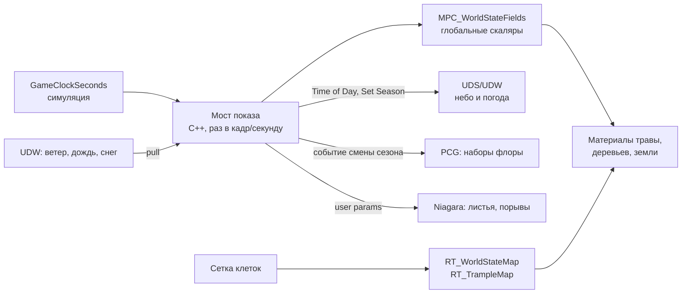

# Живая растительность: сезоны, сутки, погода — связь шейдеров, PCG и симуляции

Исследование и план (2026-09-16, запрос пользователя): как подключить функции
материалов к шейдерам и связать экосистему воедино — листопад и исчезновение
травы по сезонам через Ultra Dynamic Weather, раскрытие цветов по времени суток,
что из этого может взять PCG. **Только план, кода нет.** Черновик, не канон.

Пометки: ✅ — подтверждено кодом проекта или прочитанным первоисточником;
⚠️ — подтверждено поиском или разбором, но не проверено в редакторе на нашей
версии; ❓ — не найдено, нужна проверка.

---

## 0. Коротко

1. **Один источник времени — `GameClockSeconds`.** Симуляция уже считает сутки,
   луну, сезон и погоду сама (§15.2–15.7 GDD). Материалы, небо, погода и PCG —
   только **показ** этого состояния. UDS/UDW следуют за часами проекта, а не
   наоборот (решение §15.7 «Что такое UDS и UDW» остаётся в силе).
2. **Носитель выбирается по скорости изменения:**
   - непрерывно и глобально (время суток, вес сезона, ветер, снег, дождь) —
     `MPC_WorldStateFields`, материал;
   - непрерывно и по месту (порча, тропы, вытоптанность) — рендер-таргеты
     `RT_WorldStateMap`/`RT_TrampleMap`, функции `MF_*` (уже есть);
   - дискретно и редко (смена набора флоры к сезону, здоровая/порченая трава) —
     PCG с перегенерацией по событию;
   - мгновенные события (порыв ветра, падающие листья у игрока) — Niagara.
3. **Главное ограничение — Nanite Foliage в 5.7.** Проект включил
   `r.Nanite.Foliage=True` и плагин Procedural Vegetation Editor (коммит
   `7398087`). По документации Epic у Nanite Foliage **WPO не рекомендован, а
   маскированная прозрачность не поддерживается** ✅. Значит, листопад на
   PVE-деревьях нельзя делать «истончением маски листвы» — нужны смена вариантов
   ассета, цвет и частицы. Для обычной травы WPO и маска остаются, но с ценой.
4. **Три сезона проекта против четырёх у UDW.** Осень у нас — окно конца Лета
   (`IsLateSummer`), около 12.5 реальных часов на весь год. Визуальная осень
   либо живёт в этом окне, либо расширяется только для показа — решение за
   пользователем (§8).
5. **Лимит MPC — не больше двух коллекций на материал** ✅. Если брать
   готовые функции UDW (`Sample UDW Seasons`), а они читают свою коллекцию, у
   материала не останется места на третью. Рекомендация: веса сезонов считает
   C++ и пишет в нашу `MPC_WorldStateFields`, UDW получает сезон через
   `Set Season` только для неба и погоды.

---

## 1. Что уже есть

### Время и погода в симуляции ✅

| Что | Где | Замечание |
|---|---|---|
| Часы | `AGridWorldManager::GameClockSeconds` | переживают сейв |
| Сутки | `GetTimeOfDay01`, `IsDawn`, `IsDusk`, `IsNight`, `GetDuskProgress01`, `IsPoludnitsaWindow` | `BlueprintCallable` |
| Луна | `GetMoonPhase` | 4 фазы по 7 суток |
| Сезон | `GetSeason` (Весна/Лето/Зима), `GetSeasonProgress01`, `IsLateSummer` (осень-прокси), `IsKupalaNight` | трёхполье, §15.4 |
| Погода | `GetWindIntensity`, `GetSnowIntensity`, `GetRainIntensity`, `IsWindy`, `IsBlizzard`, `IsRainy` | шум от часов; при активном мосте — кэш из UDW |
| Мост UDW → C++ | `SetWeatherBridgeIntensities(Rain, Snow, Wind, Fog)` | C++ готов, Blueprint-моста и акторов UDS/UDW на `L_TestDev` нет (ROADMAP) |

Консольной команды перемотки часов нет — только `UseYarnBall` (двигает часы на
время пути). Для проверки сезонов её придётся завести (§7, этап 1).

### Масштабы времени ✅

| Цикл | Игровое | Реальное |
|---|---|---|
| Сутки | 1 | 32 мин: рассвет 6, день 14, закат 6, ночь 6 |
| Лунный месяц | 28 суток | ≈ 15 ч |
| Сезон | 117 суток | ≈ 62 ч |
| «Осень» (конец Лета) | 6.66% года (замер §15.8) | ≈ 12.5 ч |
| Год | 351 сутки | ≈ 187 ч |

Следствие: **смену сезона игрок в одной сессии почти не увидит** — сезонный
показ должен быть непрерывной функцией прогресса (без скачков на границах), а
заметные «моменты» (первый снег, листопад) — короткими окнами внутри сезона.
Суточный цикл, наоборот, быстрый: цветок, раскрывающийся за рассвет, делает это
за 6 реальных минут — это видно глазом.

### Карты мира и функции материалов ✅

- `MPC_WorldStateFields`: `GlobalMorok`, `GlobalZaryana`, `MorokColor`,
  `ZaryanaColor`, `WorldStateMapOrigin`, `WorldStateMapSize`, `TrampleMapFrame`,
  `TramplePlayerPosition`. Сезона, суток и погоды в ней пока нет.
- `RT_WorldStateMap` (R/G/B/A = Distortion/Corruption/HarvestStress/
  ShrineInfluence), `RT_TrampleMap` (тропы).
- `MF_SampleWorldState`, `MF_SampleTrample`, `MF_TrampleCompressWPO` —
  собраны, в материалы не подключены (`TOOLS_REFERENCE.md`).
- `M_Foliage_Master` уже читает карту мира (цвет травы по клетке, проверено
  2026-09-08); `M_landscape` и `M_Floor` рисуют тропы.

### PCG ✅

- `Get Herbalist Grid` — сетка как облако точек с осями состояния.
- `Sample Herbalist Cell` — пишет чужим точкам состояние клетки и `MeshKey`
  (`Healthy`/`Degrading`) по липкому `bDegrading`; в `PCG_Grass` не вставлен.
- `PCG_Grass` — четыре спавнера одного меша, на GPU; долг из ROADMAP.

### Данные трав ✅

`FIngredientTableRow`: `AllowedSeasons`, `bAutumnOnly`, `HarvestTimeWindow`
(рассвет/день/закат/ночь), `bRequiresDryWeather`, `bRequiresMoonPhase`. Это уже
готовая разметка «когда трава доступна» — её же разумно брать для «когда
цветок раскрыт» (§3.3), чтобы вид и механика сбора не расходились.

### Ultra Dynamic Sky/Weather в Content ✅ (поведение ⚠️)

Найдено в `Content/UltraDynamicSky`: функции материала `Season_Color_Blend`,
`DLWE_SnowCoverage`, `DLWE_PuddleMask`; образцы `Sample_UDW_Seasons`,
`Sample_UDW_Wind`, `Foliage_Wind_Movement`; перечисления `UDS_Season`,
`UDS_SeasonMode`; пресеты снега и пыли. Какую коллекцию параметров читают эти
функции — ❓, открыть в редакторе.

---

## 2. Архитектура: один источник, пять носителей

Правила:

- **Одна запись на величину.** Время суток пишет только мост; UDS его не
  считает сам. Погоду либо ведёт UDW (и мост её читает), либо ведёт шум проекта
  (и мост толкает её в UDW) — не оба сразу (§8, вопрос 4).
- **Материал не считает календарь.** В шейдер приходят готовые веса
  (`SeasonWeights`, `DayPhaseWeights`), а не часы — иначе формулы сезона
  разойдутся между C++ и десятком материалов.
- **Сглаживание — на стороне моста**, как у карты мира
  (`WorldStateMapVisualRatePerSecond`): материал получает уже плавные значения.

### Предлагаемые параметры `MPC_WorldStateFields`

| Параметр | Тип | Значение | Откуда |
|---|---|---|---|
| `TimeOfDay01` | scalar | доля суток | `GetTimeOfDay01` |
| `DayPhaseWeights` | vector | веса Рассвет/День/Закат/Ночь, сумма 1, плавные переходы | из `GetTimeOfDay01` и таблицы §15.2 |
| `SeasonWeights` | vector | веса Весна/Лето/Осень/Зима, сумма 1 | из прогресса года, §2.1 |
| `SeasonUDW` | scalar | тот же сезон в формате UDW 0..4 | для `Set Season` и отладки |
| `LeafDrop01` | scalar | доля опавшей листвы: 0 летом, растёт осенью, 1 зимой, падает весной | из `SeasonWeights` |
| `SnowCover01` | scalar | снежный покров, копится и тает медленнее, чем идёт снег | интеграл `GetSnowIntensity` |
| `Wetness01` | scalar | мокрость, высыхает с задержкой | интеграл `GetRainIntensity` |
| `WindVector` | vector | направление XY и сила | UDW или шум |
| `MoonFull01` | scalar | близость к полнолунию | `GetMoonPhase` (для ночных цветов) |

Бюджет: 1024 скаляра и 1024 вектора на коллекцию ✅ — места хватит. Ограничение
«не больше двух коллекций на материал» ✅ важнее (§6).

### 2.1 Три сезона проекта → четыре визуальных

UDW хранит сезон числом 0..4: целые — середины сезонов (0 весна, 1 лето,
2 осень, 3 зима), 4 = снова весна, дробные — смесь ⚠️ (разбор API, не
официальная страница). Режимы: «Derived from date» и «Uncontrolled» с
`SetSeason(value)` ⚠️.

Предлагаемое соответствие (год делится на три равных сезона):

| Момент года | Сезон проекта | Визуальный вес | `SeasonUDW` |
|---|---|---|---|
| Весна, середина | Весна | Весна 1 | 0 |
| Весна → Лето | граница | плавный переход за последние ~10% Весны | 0 → 1 |
| Лето, основная часть | Лето | Лето 1 | 1 |
| Конец Лета (`IsLateSummer`) | Лето | Лето → Осень | 1 → 2 |
| Граница Лето → Зима | граница | Осень → Зима за начало Зимы | 2 → 3 |
| Зима | Зима | Зима 1 | 3 |
| Зима → Весна | граница | Зима → Весна | 3 → 4 (= 0) |

Механика сезонов не меняется: это только кривая показа. Длина визуальной
осени — открытый вопрос (§8, 1).

---

## 3. Растительность: что и чем

### Порядок слоёв в материале

Один и тот же порядок для травы, листвы и земли, чтобы эффекты складывались
предсказуемо:

1. **Сезон** — базовый цвет и высота (весенняя свежесть, летняя сочность,
   осенняя желтизна, зимняя пожухлость).
2. **Состояние клетки** — порча и искажение из `MF_SampleWorldState`
   (десатурация, цвет Морока), по `InsideWindow`.
3. **Тропы** — `MF_SampleTrample`/`MF_TrampleCompressWPO`.
4. **Погода** — мокрость, снег поверх всего.
5. **Время суток** — раскрытие цветков, ночное свечение.

### 3.1 Трава: пропадает зимой

| Вариант | Как | Плюсы | Минусы |
|---|---|---|---|
| А. Материал | высота через WPO к основанию: `Squash = max(Trample, WinterSquash, SnowCover01)` — обобщение `MF_TrampleCompressWPO`; цвет по `SeasonWeights`; под снегом — землю закрывает `DLWE_SnowCoverage` ⚠️ | плавно, без пересборки, с разбросом по `PerInstanceRandom` | WPO стоит: `Max WPO Displacement`, отдельный bin на материал ✅; трава остаётся в мире (отрисовка, тени) |
| Б. PCG | плотность травы — параметр графа по сезону, зимой спавнер ставит пожухлый меш или меньше точек | зимой травы честно нет | перегенерация по смене сезона ⚠️, возможен «хлопок» — прятать за снегопадом |
| В. Оба | материал ведёт плавный переход, PCG раз в сезон меняет набор | лучший вид | больше работы |

Рекомендация — **В**: материал для непрерывного, PCG для дискретного (§4).
Разброс: не вся трава пропадает одновременно — порог сдвигается на
`PerInstanceRandom` и на шум по мировой позиции.

### 3.2 Деревья: листопад

Способ зависит от того, чем будут деревья:

| Деревья | Цвет листвы | Опадание | Голые ветки |
|---|---|---|---|
| **PVE / Nanite Foliage** (скиннинг, сборки) | материал по `SeasonWeights` ✅ (пиксельный шейдер) | маска **не поддерживается** ✅, WPO не рекомендован ✅ → смена варианта ассета | отдельный вариант сборки «зима» из PVE ⚠️; смена через PCG по `SeasonKey` (§4) или по экземпляру |
| **Обычные** (нынешние `MI_Common_Tree_Leaves` с маской) | материал | порог маски по шуму против `LeafDrop01` + `PerInstanceRandom`, dithered | тот же порог до 1 |

Общие для обоих:

- **Падающие листья** — Niagara у игрока (эмиттер на источнике генерации или
  камере), темп ∝ скорость роста `LeafDrop01` × ветер, цвет из сезона. Только в
  лиственных биомах: биом клетки под игроком мост знает сам.
- **Подстилка на земле** — слой ландшафта по «осени, которая была»: растёт
  осенью, под снегом скрыта, к середине весны сходит.
- **Смену варианта** (летнее дерево → осеннее → голое) прячет сама погода:
  порыв ветра с листопадом, снегопад. Kena делает то же самое на событии
  очищения (ветер + VFX, `DESIGN_Kena_Corruption_Research.md` §1).

Сюда же ложится предложение Kena №1 «увядание и отрастание шейдером»: сезонный
и порченый вид — одна система слоёв (§3, порядок).

### 3.3 Цветы: раскрываются по времени суток

**Данные.** Когда цветок раскрыт — из `HarvestTimeWindow` карточки: у каждого
вида своё окно, и игрок видит то же, что работает в механике сбора. Карточки
вида «собирать на рассвете, **пока цветок не раскрылся**» означают обратное —
цветок закрыт в окно сбора. Такие случаи надо разметить явно (§8, 6).

**Как материал знает вид.** Через инстанс материала на меш вида: параметр
`OpenPhase` (вектор весов Рассвет/День/Закат/Ночь). Per-instance данные не
нужны — раскрытие = `dot(OpenPhase, DayPhaseWeights)`, со сдвигом по
`PerInstanceRandom`, чтобы поляна раскрывалась волной, а не разом.

| Способ | Как | Для чего |
|---|---|---|
| WPO | лепестки поворачиваются к центру, маска — цвет вершин ⚠️ (известный приём) | обычные меши цветов |
| Nanite Skinning + банк анимаций | поза «открыт/закрыт» по экземпляру ❓ — управление временем по экземпляру в 5.7 не подтверждено, темы на форуме Epic открыты | цветы из PVE, если WPO нельзя |
| Смена меша | PCG `MeshKey` «открыт/закрыт» по фазе | дёшево, но видно переключение; смена фазы каждые 6–14 мин — слишком часто для перегенерации |
| Только цвет | эмиссия ночных цветов (цвет папоротника, Купальская ночь по `IsKupalaNight`) | без геометрии |

Рекомендация: **WPO для травянистых цветов** (они не Nanite Foliage), свечение
материалом, PVE-цветы — отложить до проверки банка анимаций.

### 3.4 Погода

- **Ветер.** Сила и направление — `WindVector`. Трава с WPO: `Foliage_Wind_
  Movement` UDW ⚠️ или свой ветер. PVE-деревья: плагин Dynamic Wind (скиннинг,
  экспериментальный ✅), параметры из того же источника. `MF_TrampleCompressWPO`
  уже гасит ветер на тропе.
- **Дождь.** `Wetness01`: темнее и глянцевее листва и земля; лужи на ландшафте —
  `DLWE_PuddleMask` ⚠️.
- **Снег.** `SnowCover01`: `DLWE_SnowCoverage` на ландшафте и камнях ⚠️, на
  кронах — по нормали вверх; трава прижимается (§3.1).

---

## 4. PCG: что отдавать графу

**Не отдавать непрерывное.** Сутки меняются каждые 6–14 минут, сезонный вес —
каждый кадр: перегенерация на такой частоте бессмысленна. PCG получает только
дискретные ключи.

- **`SeasonKey`** — параметр графа («Spring»/«Summer»/«Autumn»/«Winter»),
  меняется четыре раза за 187 часов. Вместе с `MeshKey` от `Sample Herbalist
  Cell` даёт ключ спавнера вида `Healthy_Winter` →
  `PCGMeshSelectorByAttribute` выбирает меш.
- **Перегенерация.** Режимы запуска: `Generate On Load`, `Generate On Demand`,
  `Generate At Runtime` с радиусом генерации и `Cleanup Radius Multiplier` ✅.
  Как перезапустить граф при смене параметра из кода — в прочитанной
  документации **не описано** ❓. Варианты: сменить параметр и перегенерировать
  компонент; держать по компоненту на сезон и включать нужный; при
  `Generate At Runtime` менять ключ только для клеток, которые ещё не сгенерированы
  (старые досменятся при выходе из радиуса) — последний вариант вообще без хлопка
  у игрока.
- **Иерархическая генерация.** Сетки разного размера, дальнее — крупнее ✅. Трава
  и цветы — мелкая сетка у игрока, деревья — крупная.
- **GPU.** Спавнер и `Custom HLSL` на GPU; выборка текстур на GPU (5.6+) ⚠️;
  `PCGRenderTargetData` существует ✅ — значит, граф, возможно, может читать
  `RT_WorldStateMap` сам, без C++-узла ❓ (проверить на рантайм-цели).
- **Спавнер скиннинга.** В 5.7 есть `Instanced Skinned Mesh Spawner` для
  деревьев с Dynamic Wind ⚠️.
- **Вместе с этим закрыть долг `PCG_Grass`:** четыре спавнера одного меша,
  фильтры плотности, которые ничего не отсеивают, битая ссылка на
  `MI_Grass_Sedge_02`, плотность под карту 5×5 км (ROADMAP).
- **PVE.** Варианты деревьев по сезонам (полная крона, осенняя, голая) —
  отдельные ассеты-сборки, PCG меняет их по `SeasonKey`.

---

## 5. Мост UDS/UDW

Чеклист §15.7 GDD остаётся верным; добавляется сезон и материалы.

1. Поставить `Ultra_Dynamic_Sky` и `Ultra_Dynamic_Weather` на `L_TestDev`.
   Совет автора плагина — **дочерние Blueprint-классы**, не оригиналы (обновления
   перезатирают) ✅ (память проекта).
2. **Время → UDS.** `Time of Day` (0–2400) из `GetTimeOfDay01 × 2400` ✅ API.
   Свои циклы UDS (дата, длина суток) — отключить, чтобы не шли параллельно.
3. **Сезон → UDW.** `Season Mode` = Uncontrolled, `Set Season(SeasonUDW)` ⚠️.
   UDW тогда выбирает случайную погоду и температуру под наш сезон.
4. **Погода ← UDW.** Ветер, дождь, туман → `SetWeatherBridgeIntensities`.
   Отдельного значения снега строковый поиск не нашёл (§15.7) — читать через
   снимок погоды или вывести из осадков и температуры ❓.
5. **Мгновенность после загрузки.** Активные свойства UDS применяются 1–2 с;
   после `LoadGame` — `Hard Reset Cache` ✅ (память проекта).
6. **Сейв.** UDS/UDW умеют отдавать своё состояние одной структурой
   (`Create UDS and UDW State for Saving`) ✅. Сохранять ли её — зависит от того,
   кто ведёт погоду (§8, 4).

---

## 6. Ограничения и цена

- **Две коллекции на материал** ✅. `MPC_WorldStateFields` — одна; если функции
  UDW читают свою — вторая, и больше ничего подключить нельзя. Отсюда
  рекомендация §0.5.
- **Nanite Foliage — экспериментальный** ✅; Dynamic Wind — тоже ✅. WPO для него
  не рекомендован (пересчёт на вершину, консервативные границы кластеров,
  отдельный bin на каждый материал с WPO), маска не поддерживается ✅.
- **WPO на обычной траве** — нужен разумный `Max WPO Displacement`, иначе трава
  пропадает на краю экрана; каждый уникальный материал с WPO — отдельный bin.
- **Статические переключатели** (`Trampleable` и будущие) множат перестановки
  шейдеров — держать их на уровне семейства материалов, не на каждом инстансе.
- **Перегенерация PCG в рантайме** — цена не измерена ❓, делать редко.
- **Niagara** — только у игрока; дальний листопад показывать не частицами, а
  подстилкой и цветом.
- **Обновление MPC** дешёвое; карта мира уже выгружается раз в секунду.

---

## 7. План работ

Этапы по зависимостям; числа и имена — предложение до решений §8.

| Этап | Что | Готово, когда |
|---|---|---|
| 0 | Решения по §8 | ответы записаны в этот документ |
| 1 | **Мост показа в C++**: параметры §2 в `MPC_WorldStateFields` (коммандлет), сглаживание, кривая сезонов §2.1; консольная перемотка часов (`SetGameClock`/`SkipGameDays`) | автотесты кривых: веса в сумме 1, без скачков на границах сезонов и фаз суток; в PIE параметры меняются при перемотке |
| 2 | **UDS/UDW на `L_TestDev`** + Blueprint-мост: время, сезон, погода | небо совпадает с `GetTimeOfDay01`; `SetWeatherBridgeIntensities` получает живые значения |
| 3 | **Функции материалов слоя сезона**: `MF_SeasonWeights`, `MF_SeasonColor`, `MF_GrassSquash` (обобщение сжатия), `MF_FlowerOpen`, `MF_WeatherWetness`; подключение в `M_Foliage_Master`, `M_plants`, `M_landscape` вместе с уже готовыми `MF_*` | `-verify` компилирует; в PIE при перемотке трава желтеет и ложится, цветы раскрываются в своё окно |
| 4 | **Листопад**: Niagara у игрока, подстилка на ландшафте, варианты деревьев | за «осень» листья падают, к зиме ветки голые |
| 5 | **PCG**: `SeasonKey` × `MeshKey`, стратегия перегенерации, чистка `PCG_Grass` | смена сезона без видимого хлопка у игрока |
| 6 | **Проверка** в `docs/verification/pie/04_World_State.md` | сценарии перемотки на сутки, на границу сезона, на снегопад |

---

## 8. Вопросы, которые решает пользователь

1. **Длина визуальной осени.** Только окно `IsLateSummer` (≈ 12.5 ч реального
   времени за год) или шире — например, последняя треть Лета выглядит осенью, а
   механика остаётся трёхпольной?
2. **Деревья.** PVE/Megaplants на Nanite Foliage (скиннинг, без маски — листопад
   сменой вариантов) или нынешние маскированные деревья (истончение маской)?
   Или смешанно: ближние PVE, дальние обычные?
3. **Трава зимой.** Пропадает совсем (PCG) или ложится и жухнет под снегом
   (материал)? Рекомендация — оба (§3.1 В).
4. **Кто ведёт погоду.** UDW со своей случайной сезонной погодой (богаче вид,
   недетерминированно, нужен сейв состояния UDW) или шум проекта, толкаемый в
   UDW пресетами (детерминированно, как сейчас)?
5. **Функции UDW или свои.** Брать `Sample UDW Seasons`/`Season Color Blend`
   (быстрее, но вторая коллекция в материале) или свои функции над
   `MPC_WorldStateFields`?
6. **Когда раскрыт цветок.** Выводить из `HarvestTimeWindow` автоматически (с
   ручной разметкой «сбор, пока закрыт») или завести отдельное поле окна
   цветения?
7. **Сейв UDS/UDW.** Нужен ли, если время и сезон и так выводятся из
   `GameClockSeconds`?

---

## Источники

- [Nanite Foliage — Unreal Engine documentation](https://dev.epicgames.com/documentation/en-us/unreal-engine/nanite-foliage)
- [Runtime Hierarchical Generation — Unreal Engine 5.7 documentation](https://dev.epicgames.com/documentation/en-us/unreal-engine/runtime-hierarchical-generation)
- [Using PCG Generation Modes — Unreal Engine documentation](https://dev.epicgames.com/documentation/en-us/unreal-engine/using-pcg-generation-modes-in-unreal-engine)
- [Using PCG with GPU Processing — Unreal Engine documentation](https://dev.epicgames.com/documentation/en-us/unreal-engine/using-pcg-with-gpu-processing-in-unreal-engine)
- [PCGRenderTargetData — Unreal Python API](https://dev.epicgames.com/documentation/en-us/unreal-engine/python-api/class/PCGRenderTargetData?application_version=5.2)
- [Using Material Parameter Collections — Unreal Engine documentation](https://dev.epicgames.com/documentation/unreal-engine/using-material-parameter-collections-in-unreal-engine)
- [Procedural Vegetation Editor — Unreal Engine documentation](https://dev.epicgames.com/documentation/unreal-engine/procedural-vegetation-editor-in-unreal-engine?lang=en-US)
- [Instanced Skinned Mesh — Unreal Engine 5.7 Blueprint API](https://dev.epicgames.com/documentation/unreal-engine/BlueprintAPI/Components/InstancedSkinnedMesh)
- [AnimBank & InstancedSkinnedMeshComponent — Epic forums](https://forums.unrealengine.com/t/animbank-instancedskinnedmeshcomponent/2691277)
- [Dynamic Wind — Unreal Engine 5.7 Blueprint API](https://dev.epicgames.com/documentation/en-us/unreal-engine/BlueprintAPI/DynamicWind)
- [Unreal Engine 5.7 Performance Highlights — Tom Looman](https://tomlooman.com/unreal-engine-5-7-performance-highlights/)
- [Ultra Dynamic Sky 9.7 Documentation](https://www.ultradynamicsky.com/Documentation/V9/9-7)
- [UDW: random weather, seasons, temperature — разбор API (skills.lc)](https://skills.lc/kevinpbuckley/unreal-engine-skills/kevinpbuckley-unreal-engine-skills-skills-ultra-dynamic-weather-udw-random-seasons-temperature-skill-md)
- [Flower Bloom UE5 — Emmett Green](https://tsukeoni.wordpress.com/2021/07/04/flower-bloom-ue5/)
- [World Position Offset Material Functions — Unreal Engine documentation](https://dev.epicgames.com/documentation/en-us/unreal-engine/world-position-offset-material-functions-in-unreal-engine)
